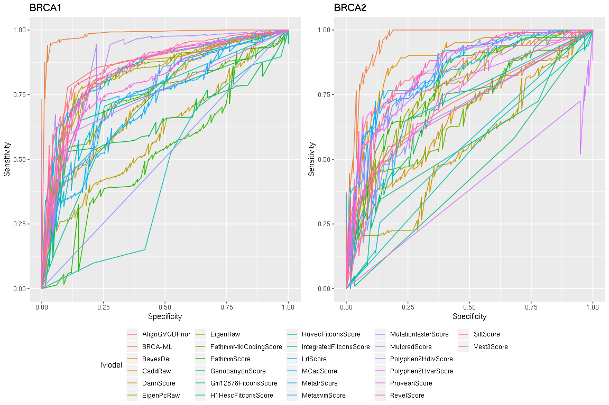
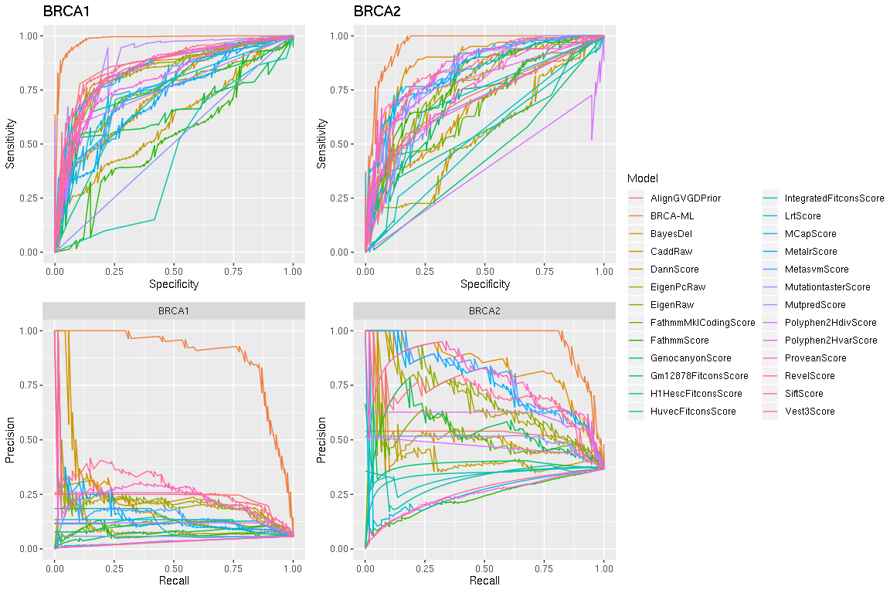
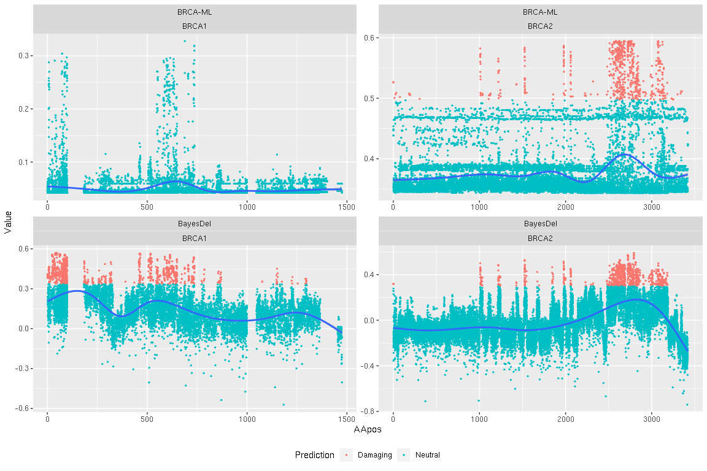

<style type="text/css">
.main-container {
  max-width: 1800px;
  margin-left: auto;
  margin-right: auto;
}
</style>


```r
all_annotations = read.csv('sources/v3.4a.out',header=TRUE, stringsAsFactors = FALSE, sep="\t")

#Get BayesDel
bd = read.csv('sources/BayesDel_nsfp33a_noAF.tsv',header=TRUE, sep="\t", skip = 132)
bd$ID=NULL

names(bd) =c("Chr", "Pos", "Ref", "Alt", "BayesDel")
all_annotations = merge(all_annotations, bd, all.x=TRUE)
rm(bd)

#Get AlignGVGD
agvgd = read.csv('sources/alignGvgd.tsv', header=TRUE, sep="\t", stringsAsFactors = FALSE)
names(agvgd) =c("Chr", "Pos", "Ref", "Alt", "AlignGVGDPrior")
all_annotations = merge(all_annotations, agvgd, all.x=TRUE)
rm(agvgd)


for (j in names(all_annotations)[6:ncol(all_annotations)]){
    if (typeof(all_annotations[,j]) == 'character'){
      # Get the maximum score
      all_annotations[,j] = suppressWarnings(sapply(strsplit(all_annotations[,j], "\\|"), function(x) (max(as.numeric(x),na.rm = TRUE))) %>% as.numeric())
      # Remove -Inf
      all_annotations[which(all_annotations[,j] =='-Inf'),j] = NA
    }
}
######################################################
# Add my own AAPos Annotations
b1=read.csv('sources/CAVA_BRCA1.txt', header = FALSE, sep='\t', stringsAsFactors = FALSE)
b2=read.csv('sources/CAVA_BRCA2.txt', header = FALSE, sep='\t', stringsAsFactors = FALSE)
b3 = rbind(b1,b2)
names(b3) = c('CSN','Gene','Variant','ProtChange','RefProt','AApos','AltProt')
b3 = b3[,c('Gene','Variant','AApos')]
b3$AApos = as.numeric(b3$AApos)
all_annotations = all_annotations %>%
  mutate(Variant = paste(Chr,Pos,Ref,Alt,sep='_'), AApos=NULL)
all_annotations = merge(all_annotations, b3, by="Variant", all.x=TRUE)
######################################################


all_annotations = all_annotations %>%
  filter(AApos>0)

keep = names(all_annotations)[-grep("Rankscore",names(all_annotations))]
all_annotations = all_annotations[,keep]

rm(keep, j)
#glimpse(all_annotations)
```

Plot all predictions


Set some useful functions

```r
# Create a filter to remove anything not in the BRCT/RING domains of BRCA1 and the DNA binding domain of BRCA2
filter_to_target_regions = function(d, variant_search = FALSE, l = links)
{
  RING_prot = c(1, 109)
  BRCT_prot = c(1642, 1855)
  DNABD_prot = c(2479, 3192)
  
  if(variant_search == TRUE){
    d$Variant = as.character(d$Variant)
    d = merge(d, l)
  }
  
  #Filter BRCA1 variants
  d$X.CHROM = as.numeric(d$X.CHROM)
  d$AApos   = as.numeric(d$AApos)
  BRCA1_keep_idx = which(
    d$X.CHROM ==  17 & (
      dplyr::between(d$AApos, RING_prot[1], RING_prot[2]) | dplyr::between(d$AApos,BRCT_prot[1], BRCT_prot[2]) 
      )
  )
  
  BRCA2_keep_idx =  which(d$X.CHROM ==  13 & dplyr::between(d$AApos, DNABD_prot[1], DNABD_prot[2]))
  d = d[c(BRCA1_keep_idx,BRCA2_keep_idx),]
  d = distinct(d, Variant, .keep_all = TRUE)
  rm(RING_prot, BRCT_prot, DNABD_prot, BRCA1_keep_idx, BRCA2_keep_idx)
  return(d)
}


### Define the MCC function
mcc <- function(predicted, actual)
{
  TP <- sum(actual ==   "Damaging" & predicted ==   "Damaging")
  TN <- sum(actual ==   "Neutral"     & predicted ==   "Neutral")
  FP <- sum(actual ==   "Neutral"     & predicted ==   "Damaging")
  FN <- sum(actual ==   "Damaging" & predicted ==   "Neutral")
  mcc <- ((TP*TN) - (FP*FN)) / sqrt((as.numeric(TP + FP)*as.numeric(TP + FN)*as.numeric(TN + FP)*as.numeric(TN + FN)))
  rm(TP, TN, FP, FN)
  return(round(mcc, digits = 3))
}

  

links = all_annotations %>% 
  mutate(Variant = paste(Chr,Pos, Ref, Alt, sep = "_")) %>%
  mutate(X.CHROM=Chr, POS=Pos, REF=Ref, ALT=Alt) %>%
  select(X.CHROM, AApos, Variant )
```


Load all functional data

```r
#Read in our data
neutral_list = read.csv("sources/neutral.list",sep = "\t",header = FALSE, stringsAsFactors = FALSE)
damaging_list = read.csv("sources/deleterious.list",sep = "\t",header = FALSE, stringsAsFactors = FALSE)

Hart_df = rbind(neutral_list,damaging_list)
names(Hart_df) = c("Gene","Variant","Call", "Source")

Hart_df = filter_to_target_regions(Hart_df, variant_search = TRUE)

rm(neutral_list, damaging_list)


# Read in annotations from CAVA
CAVA_BRCA1 = read.csv('sources/CAVA_BRCA1.txt',header = FALSE,
                   sep = "\t", stringsAsFactors = FALSE, 
                   na.strings = c('.'))
names(CAVA_BRCA1)=c('CSN','Gene','cpra','variantID', 'refAA','AApos', 'altAA')

# Read in annotations from CAVA
CAVA_BRCA2 = read.csv('sources/CAVA_BRCA2.txt',header = FALSE,
                   sep = "\t", stringsAsFactors = FALSE, 
                   na.strings = c('.'))
names(CAVA_BRCA2)=c('CSN','Gene','cpra','variantID', 'refAA','AApos', 'altAA')
```


```r
#######################################################################################################################################
#Read in Starita
#Get data
HDR_damaging_max = 0.33
HDR_neutral_min = 0.77

# Update 05/26/2019: Start from Startia et al Table S7, as an input
Starita = read.csv('sources/StaritaST7.tsv.txt',header = TRUE,
                   sep = "\t", stringsAsFactors = FALSE, 
                   na.strings = c('.'))

# Need to merge annotations so I can cross-reference
Starita = merge(Starita, CAVA_BRCA1, by='variantID')
# Remove duplicate variants
Starita = Starita %>%
  select(Starita_HDR_predict, variantID, cpra) %>%
  unique()
Starita$HDR=as.numeric(Starita$Starita_HDR_predict)

Starita = Starita %>%
  filter(HDR <=   HDR_damaging_max | HDR >=  HDR_neutral_min)


Starita_df = data.frame(
  Variant = as.character(Starita$cpra),
  Gene = 'BRCA1',
  Call = ifelse(Starita$HDR <=  HDR_damaging_max, "Damaging", 'Neutral' )
)
Starita_df = na.omit(Starita_df)

Starita_df = Starita_df %>%
  select(Gene, Variant, Call) %>%
  mutate(Source = "Starita et al., 2015") %>%
  unique()

Starita_df    = filter_to_target_regions(Starita_df, variant_search = TRUE)

rm(Starita, HDR_damaging_max, HDR_neutral_min)
```


```r
#######################################################################################################################################
#Read in Fernandes
#Get data
Fernandes = read.csv('sources/Fenandez.tsv', header = TRUE, 
                     sep = "\t", stringsAsFactors = FALSE)
#Remove WT and splic variants
omit = Fernandes$variant[grep('del|\\+|WT|\\/|ins',Fernandes$variant)]

Fernandes = Fernandes %>%
  filter(!variant %in% omit) %>%
  filter(IARC %in% c(0,1,4,5)) %>%
  mutate(Call = ifelse(IARC > 2, "Damaging", "Neutral"), Gene = 'BRCA1') %>%
  select(Gene, Variant, Call) %>%
  mutate(Source = "Fernandes et al., 2019") %>%
  unique()

Fernandes_df    = filter_to_target_regions(Fernandes, variant_search = TRUE)

rm(Fernandes, omit)
```


```r
#######################################################################################################################################
#Read in Findlay
#Get data

# Update 05/26/2019: Start from Findlay et al Table S1, as an input

Findaly = read.csv('sources/Findlay_ST1.txt', header = TRUE,sep = "\t", 
                   stringsAsFactors = FALSE, na.strings = c('','NA','.'))
Findaly = Findaly %>% 
  mutate(cpra=paste(chromosome,`position..hg19.`,reference,alt,sep="_" ))
# Merge with annotations
Findaly = merge(Findaly, CAVA_BRCA1, by='cpra')


# Exclude splicing (1/28)
Findaly = Findaly %>%
  filter(consequence=='Missense', func.class %in% c('FUNC','LOF')) 

AlreadySeen = c(Fernandes_df$Variant, Starita_df$Variant)
Findaly$AlreadySeen = as.numeric(Findaly$cpra %in% AlreadySeen)

Fin_df = data.frame(
  Gene = Findaly$Gene,
  Variant = Findaly$cpra,
  Call = Findaly$func.class,
  Score = Findaly$function.score.mean,
  Seen = Findaly$AlreadySeen)

Findlay_df = Fin_df %>%
  filter(Seen ==  0)

Findlay_df$Call =  ifelse(Findlay_df$Call ==  'FUNC', 'Neutral', 'Damaging')

Findlay_df = Findlay_df %>%
  select(Gene, Variant, Call) %>%
  mutate(Source = "Findlay et al., 2018") %>%
  unique()

Findlay_df = filter_to_target_regions(Findlay_df, variant_search = TRUE)

rm(Fin_df, Findaly)
```


```r
#######################################################################################################################################
# Combine experimental datasets
experimental_data = rbind(Hart_df, Fernandes_df, Starita_df, Findlay_df)
d = as.data.frame(table(experimental_data$Gene, experimental_data$Call, experimental_data$Source))
names(d) = c('Gene', 'Call', 'Source', 'RawCount')

experimental_data = distinct(experimental_data, Gene, Variant, .keep_all = TRUE)
e = as.data.frame(table(experimental_data$Gene, experimental_data$Call, experimental_data$Source))
names(e) = c('Gene', 'Call', 'Source', 'FilteredCount')

Counts = cbind(d, e$FilteredCount)
names(Counts)[length(names(Counts))] = 'FilteredCount'


rm(Hart_df, Fernandes_df, Starita_df, Findlay_df)
table(experimental_data$Source, experimental_data$Call,experimental_data$Gene)
```

```
## , ,  = BRCA1
## 
##                         
##                          Damaging Neutral
##   Fernandes et al., 2019        0     116
##   Findlay et al., 2018        329    1232
##   Guidugli et al., 2014         0       0
##   Guidugli et al., 2018         0       0
##   Hart et al, 2018              2      11
##   Lee et al., 2010             52      36
##   Lindor et al., 2012           0       0
##   Starita et al., 2015         11      77
##   This paper                    0       0
##   Woods et al., 2016            7      18
## 
## , ,  = BRCA2
## 
##                         
##                          Damaging Neutral
##   Fernandes et al., 2019        0       0
##   Findlay et al., 2018          0       0
##   Guidugli et al., 2014         4       0
##   Guidugli et al., 2018        38      48
##   Hart et al, 2018             16      47
##   Lee et al., 2010              0       0
##   Lindor et al., 2012           9      18
##   Starita et al., 2015          0       0
##   This paper                    7      15
##   Woods et al., 2016            0       0
```

```r
table(experimental_data$Call,experimental_data$Gene)
```

```
##           
##            BRCA1 BRCA2
##   Damaging   401    74
##   Neutral   1490   128
```

More custom functions


```r
prepare_inputs = function(data = experimental_data, 
                          annotations = all_annotations, 
                          gene = 'BRCA1', 
                          sources = NULL){

  s = NULL

  if ('Hart' %in% sources){s = c("This paper", "Guidugli et al., 2018", 
                                 "Hart et al, 2018", "Lee et al., 2010",
                                 "Lindor et al., 2012", "Woods et al., 2016", 
                                  "Guidugli et al., 2014")}
  if ('Fernandes' %in% sources){s = c(s, 'Fernandes et al., 2019')}
  if ('Starita' %in% sources){s = c(s, 'Starita et al., 2015')}
  if ('Findlay' %in% sources){s = c(s, 'Findlay et al., 2018')}
  
  # if sources = PATH, then take all pathogenic variants from all studies and benign from our study
  if(is.null(s)){
    data = data %>%
      filter(Gene == gene)
  }else{
    # Filter to known results for a specific gene
    data = data %>%
      filter(Source %in% s, Gene == gene)
  }
  
  data = distinct(data, Gene, Variant, .keep_all = TRUE)
  
  #Merge to get annotations
  data = merge(data,
    annotations,
    all.x = TRUE,
    by = 'Variant')
  
  # Sort list randomly
  data = sample(data)
  if ('Gene.x' %in% names(data)){ data = data %>% mutate(Gene = Gene.x, Gene.x=NULL, Gene.y=NULL)}
  if ('AApos.x' %in% names(data)){ data = data %>% mutate(AApos = AApos.x, AApos.x=NULL, AApos.y=NULL)}
  if ('X.CHROM.x' %in% names(data)){ data = data %>% mutate(X.CHROM = X.CHROM.x, X.CHROM.x=NULL, X.CHROM.y=NULL)}
  return(data)
}

split_data = function(known_scores, validation_fraction = 0.2 ){
  set.seed(999)
  known_scores$Call = as.factor(known_scores$Call)
  num_predictions = nrow(known_scores)

  #Create training testing and validation
  Neutral_idx = which(known_scores$Call == 'Neutral')
  Damaging_idx = which(known_scores$Call == 'Damaging')
  
  n_train_idx = sample(Neutral_idx, size = length(Neutral_idx) * 0.8)
  d_train_idx = sample(Damaging_idx, size = length(Damaging_idx) * 0.8)

  # Subset to training and validation
  idx = c(n_train_idx, d_train_idx)
  #Shuffle randomly
  idx = sample(idx)
  
  train_t = known_scores[idx,]
  test_t = known_scores[-idx,]
  splits = NULL
  splits$test = NULL
  splits$train = NULL
  splits$train = train_t
  splits$test = test_t
  return(splits)
}


k_fold_split_data = function(known_scores, k=10 ){
  set.seed(999)
  known_scores$Call = as.factor(known_scores$Call)
  num_predictions = nrow(known_scores)
  
  #Create training testing and validation
  Neutral_idx = which(known_scores$Call == 'Neutral')
  Neutral_fold = createFolds(Neutral_idx, k = k, list = FALSE)
  Damaging_idx = which(known_scores$Call == 'Damaging')
  Damaging_fold = createFolds(Damaging_idx, k = k, list = FALSE)
  
  
  # Subset to training and validation
  idx_f = c(Neutral_fold, Damaging_fold)
  
  known_scores$Fold = idx_f
  
  splits = sample(known_scores)
  return(splits)
}


train_model = function(splits, k_=NULL, Gene = 'BRCA1'){
  knitr::opts_chunk$set(echo=FALSE)

  h2o.init(min_mem_size = "8g", max_mem_size = "12g", nthreads = 10)
  
  train_ = as.h2o(splits$train)
  
  all_h2o_models =  h2o.automl(x = COLUMNS, y = "Call",
                  training_frame = train_,
                  keep_cross_validation_predictions = TRUE,
                  keep_cross_validation_models=TRUE,
                  keep_cross_validation_fold_assignment=TRUE,
                  nfolds = 5,
                  max_runtime_secs = training_time_limit,
                  sort_metric = 'mean_per_class_error',
                  stopping_metric = 'mean_per_class_error',
                  seed = 100)
  knitr::opts_chunk$set(echo=TRUE)
  
  #Save the model
  best_model = h2o.saveModel(object = all_h2o_models@leader,path = "results/",force = TRUE)
  best_model
  cv_predictions = h2o.getFrame(all_h2o_models@leader@model[["cross_validation_holdout_predictions_frame_id"]][["name"]])
  cv_groups = h2o.getFrame(all_h2o_models@leader@model[["cross_validation_fold_assignment_frame_id"]][["name"]])
  # Load model
  model_out = h2o.loadModel(best_model)
  model_vi  = as.data.frame(all_h2o_models@leader@model$variable_importances)
  threshold = h2o.find_threshold_by_max_metric(h2o.performance(model_out), 'absolute_mcc')
  my_list   = list('all_h2o_models' = all_h2o_models, 'best_model' = best_model, 
                   'model' = model_out, 'vi' =  model_vi, 'threshold' = threshold, 
                   'cv_predictions' = as.data.frame(cv_predictions), cv_groups = as.data.frame(cv_groups))
  return(my_list)
  }


test_model = function(splits, model, threshold = NULL){

  knitr::opts_chunk$set(echo=FALSE)
  h2o.init(min_mem_size = "16g", max_mem_size = "32g", nthreads = 1)

  test = as.h2o(splits$test)
  
  pred = h2o.predict(model, 
                     newdata = test, 
                     threshold = threshold)
  knitr::opts_chunk$set(echo=TRUE)

  pred = as.data.frame(pred)

  #Edit prediction based on previous threshold
  final_result = cbind(splits$test, pred)

  cm = confusionMatrix(final_result$predict,final_result$Call, positive = 'Damaging')
  m = mcc(final_result$predict,final_result$Call)
  my_list = list('result' = final_result, 'cm' = cm, 'MCC' = m)
  return(my_list)
}

apply_model_to_gene = function(model = model, threshold = threshold,
                               gene = 'BRCA1', annotations = all_annotations){
  #Run model on each gene
  tmp = annotations %>%
    filter(Genename == gene)
  pred = h2o.predict(model, newdata = as.h2o(tmp), threshold = threshold)
  pred = as.data.frame(pred)
  tmp$Prediction = pred$predict
  tmp$`BRCA-ML` = pred$Damaging
  tmp$Neut = pred$Neutral
  return(tmp)
}


plot_full_gene = function(data, title, splits = splits, model_name='BRCA-ML', t_=NULL){
  
  #Pull out training, validation, & testing variants to plot
  
  if(length(splits$train)){
    variants = splits$train %>%
      select(AApos, Call)
    
  
    variants = rbind(variants,splits$test %>%
      select(AApos, Call)
    )  
  }else{
    variants = NULL
  }
  
  tmp = data[,c("Genename","BRCA-ML","AApos","Prediction")]
  tmp$Model = model_name
  names(tmp) = c("Gene","Score","AApos","Prediction","Model")
  tmp$Prediction = as.character(tmp$Prediction)
  if (!is.null(t_)){tmp = tmp %>% mutate(Prediction = ifelse(Score > t_, 'Damaging', 'Neutral'))}
  p = tmp %>%
    ggplot(aes(x = AApos,y = Score, colour = Prediction)) +
    geom_point(size = 0.2) +
    #facet_grid(Model ~ Gene, scales = 'free') +
    geom_smooth(aes(x = AApos,y = Score), inherit.aes = FALSE) +
    ggtitle(title) +
    theme(legend.position="none") 
  if(length(splits$train)){
    p = p + geom_rug(
        aes(x=AApos, colour=Call, alpha = 1/2), 
        inherit.aes = FALSE, 
        sides = "b", 
        data = variants)
  }
  return(p)
}
```


```r
  get_cv_estimate = function(gene='BRCA1'){
    h2o.init(min_mem_size = "8g", max_mem_size = "10g", nthreads = 36)
    # Nested cross validation of the "pick the leader" process
    #bx_input = b1_DATA_SPLITS$train
    if (gene == 'BRCA1'){
      bx_input = b1_DATA_SPLITS$train
    }else{
      bx_input = b2_DATA_SPLITS$train
    }
    bx_DATA_SPLITS = k_fold_split_data(bx_input, k = v_fold_nest)  # change to k-fold CV, 2020-05-28
    
    preds = NULL
    for(v in 1:v_fold_nest) {
        train_v <- bx_DATA_SPLITS[which(bx_DATA_SPLITS$Fold != v), ]
        test_v <- bx_DATA_SPLITS[which(bx_DATA_SPLITS$Fold == v), ]
        
        train = as.h2o(train_v)
        all_h2o_models = h2o.automl(x = COLUMNS, y = "Call",
                        training_frame = train,
                        keep_cross_validation_predictions = FALSE, # don't need these
                        nfolds = 5,  # should be increased to 10?
                        max_runtime_secs = training_time_limit,
                        algo_parameters = list(list(min_rows=-1)),
                        sort_metric = 'mean_per_class_error',
                        stopping_metric = 'mean_per_class_error',
                        seed = 100)
        test = as.h2o(test_v)
        pred = h2o.predict(all_h2o_models@leader, newdata = test)
        pred= as.data.frame(pred)
        pred = cbind(pred, test_v)
        preds = rbind(preds, pred)

        write.csv(preds, file=paste0('results/', gene,'_res.fold',v,'.csv'))
    }
    return(preds)
  }
```

Define columns to TRAIN on


```r
models = read.csv('sources/base_thresholds', header = FALSE, sep="\t", stringsAsFactors = FALSE)
COLUMNS = models$V1
```

Prepare inputs for the training

```r
#BRCA1
b1_input = prepare_inputs(gene = 'BRCA1')
b1_DATA_SPLITS = split_data(b1_input)

b2_input = prepare_inputs(gene = 'BRCA2')
b2_DATA_SPLITS = split_data(b2_input)
```

Calculate nested cross validation metrics

```r
#Add in metrics from our current model
if (train==TRUE){
  b1_cv = get_cv_estimate(gene = 'BRCA1') # WARNING! THIS TAKES AN EXTREMELY LONG TIME!!
  b2_cv = get_cv_estimate(gene = 'BRCA2') # WARNING! THIS TAKES AN EXTREMELY LONG TIME!!
} else{
  for (v in 1:v_fold_nest){
    b1_cv = NULL
    b2_cv = NULL
    b1 = read.csv(paste0('results/','BRCA1_res.fold',v,'.csv'))
    b1_cv = rbind(b1_cv, b1)
    b2 = read.csv(paste0('results/','BRCA2_res.fold',v,'.csv'))
    b2_cv = rbind(b2_cv, b2)
    b1_cv = na.omit(b1_cv)
    b2_cv = na.omit(b2_cv)
  }
}
```

Train

```r
if (train==TRUE){
  b1_TRAINED_DATA = train_model(b1_DATA_SPLITS)
}else{
  h2o.init()
  model_out = h2o.loadModel('results/GBM_grid__1_AutoML_20200622_080955_model_22')
  model_vi  = as.data.frame(model_out@model$variable_importances)
  threshold = h2o.find_threshold_by_max_metric(h2o.performance(model_out), 'absolute_mcc')
  
  b1_TRAINED_DATA   = list('all_h2o_models' = NULL, 'best_model' = model_out@model_id, 
                   'model' = model_out, 'vi' =  model_vi, 'threshold' = threshold, 
                   'cv_predictions' = b1_cv)

}
b1_TESTED_DATA = test_model(b1_DATA_SPLITS, b1_TRAINED_DATA$model, threshold = b1_TRAINED_DATA$threshold)
b1_PREDICTIONS = apply_model_to_gene(model = b1_TRAINED_DATA$model, 
                                          gene = 'BRCA1', 
                                          threshold = b1_TRAINED_DATA$threshold)
b1_PLOTS = plot_full_gene(b1_PREDICTIONS, 
                               'BRCA1', 
                               splits = b1_DATA_SPLITS, 
                               t_ = b1_TRAINED_DATA$threshold )
```


```r
#BRCA2

if (train==TRUE){
  b2_TRAINED_DATA = train_model(b2_DATA_SPLITS)
  }else{
   h2o.init()
  model_out = h2o.loadModel('results/GBM_grid__1_AutoML_20200622_085730_model_23')
  model_vi  = as.data.frame(model_out@model$variable_importances)
  threshold = h2o.find_threshold_by_max_metric(h2o.performance(model_out), 'absolute_mcc')
  # Get CV predictions
  cv_predictions=NULL
  cv_groups=NULL
  b2_cv_holdouts=NULL
  for (i in 1:v_fold_nest){
    tmp = read.csv(paste0('results/BRCA2_res.fold',i,'.csv'))

    test = as.h2o(tmp)
    pred = h2o.predict(model_out, newdata = test)
    tmp = tmp %>% select('Call','Variant')
    tmp_df = data.frame(Call=tmp$Call, Variant=tmp$Variant, cv_pred=as.data.frame(pred)[, "Damaging"],Fold=i)
    cv_predictions = rbind(cv_predictions, tmp_df)
    b2_cv_holdouts = rbind(b2_cv_holdouts, as.data.frame(pred))
    cv_groups = rbind(cv_groups, data.frame(fold_assignment=rep(i,nrow(tmp))))
  }
  b2_TRAINED_DATA   = list('all_h2o_models' = NULL, 'best_model' = model_out@model_id, 
                   'model' = model_out, 'vi' =  model_vi, 'threshold' = threshold, 
                   'cv_predictions' = as.data.frame(cv_predictions), cv_groups = as.data.frame(cv_groups))
  b2_cv_holdouts$cv_pred = b2_cv_holdouts$Damaging
  }


b2_TESTED_DATA = test_model(b2_DATA_SPLITS, b2_TRAINED_DATA$model, threshold = b2_TRAINED_DATA$threshold)
b2_PREDICTIONS = apply_model_to_gene(model = b2_TRAINED_DATA$model, 
                                          gene = 'BRCA2', 
                                          threshold = b2_TRAINED_DATA$threshold)
b2_PLOTS = plot_full_gene(b2_PREDICTIONS, 
                               'BRCA2', 
                               splits = b2_DATA_SPLITS, 
                               t_ = b2_TRAINED_DATA$threshold )
```

Make functions to determine cutoff for other missense predictors


```r
get_res = function(input_data, model){
  
  ## Use the training data to get an optimal threshold
  
  # Make a df that merges the experimental results with predictors
  tmp = input_data$train[,c('Call',model)]
  roc_obj <- roc(tmp$Call, tmp[,model])
  d = as.data.frame(coords(roc_obj, "best", ret=c("threshold","sensitivity", "specificity", "tp", "tn", "fp", "fn")))
  threshold = unlist(d[1])
  if(is.null(threshold)){threshold=0.5}
  ################################################################################
  ## 05/28/20
  tmp$Model='Neutral'
  if (model %in% c("SiftScore")){
    tmp$Model = ifelse(tmp[,model]>threshold,'Neutral','Damaging')
  }else{
    tmp$Model = ifelse(tmp[,model]<threshold,'Neutral','Damaging')  
  }
  cm = confusionMatrix(as.factor(tmp$Model), as.factor(tmp$Call), positive="Damaging")
  tp=cm$table[1]
  fn=cm$table[2]
  fp=cm$table[3]
  tn=cm$table[4]
  sensitivity=cm$byClass[1]
  specificity=cm$byClass[2]
  # Add no call information
  missingness = (nrow(tmp)-sum(cm$table))/nrow(tmp) * 100
  d = data.frame(tp=tp,fp=fp,fn=fn,tn=tn,sensitivity=sensitivity,specificity=specificity, threshold=threshold, model=model, missingness=missingness)
  ################################################################################
  rownames(d)=NULL
  d = as.data.frame(d)
  d$mcc = ((d$tp*d$tn) - (d$fp * d$fn)) / sqrt((as.numeric(d$tp + d$fp)*as.numeric(d$tp + d$fn)*as.numeric(d$tn + d$fp)*as.numeric(d$tn + d$fn)))
  d$model = model
  pr_1 =NULL
  # Add precision recall
  
  idx = which(tmp$Call=='Neutral')
  tryCatch(
    {
      pr_1 = pr.curve(
              scores.class0 = tmp[-idx, model],
              scores.class1 = tmp[idx, model], 
              curve=TRUE, sorted = FALSE)
      
      
    },
    error = function(cond){
      pr_1 = NULL
    })
    
    if (is.null(pr_1)){
      proc = NULL
      proc$V1 = 0
      proc$V2 = 0
      proc$V3 = 0
      proc$Model = model
      d$PRauc = 0
    }else{
      d$PRauc = pr_1$auc.integral
      proc = pr_1$curve %>% as.data.frame()
      proc$Model = model
    }

  my_list = list('roc' = roc_obj, 'res' = d, 'proc' = proc)
  rm(d, tmp)
  return(my_list)
  
}

compute_optimal = function(input_data=b1_DATA_SPLITS){
  RES = NULL
  ROC = NULL
  PROC = NULL
  for (model in models$V1){
    l = get_res(input_data, model)
    RES = rbind(RES, l$res)
    d1 = data.frame(sensitivities=l$roc$sensitivities, specificities=l$roc$specificities, auc = as.numeric(l$roc$auc))
    d1$Model = model
    ROC = rbind(ROC, d1)
    
    # Add PROC
    tryCatch(
      {PROC = rbind(PROC, l$proc)},
      error = function(cond){
        PROC = PROC
      }
    )
  }
  my_list = list('RES' = RES, 'ROC' = ROC, 'PROC' = PROC)
  return(my_list)
}
```


Compute optimal for BRCA1

```r
res_roc_1 = compute_optimal(input_data=b1_DATA_SPLITS)
```


```r
# Get ROC/PROC curve for BRCA-ML on CV set
roc_obj <- roc(b1_cv$Call,b1_cv$Damaging)

# Get metrics from cv-set
cm = confusionMatrix(as.factor(b1_cv$Call), b1_cv$predict, positive="Damaging")
tp=cm$table[1]
fn=cm$table[2]
fp=cm$table[3]
tn=cm$table[4]
sensitivity=cm$byClass[1]
specificity=cm$byClass[2]
# Add no call information
missingness = (nrow(b1_DATA_SPLITS$train)-sum(cm$table))/nrow(b1_DATA_SPLITS$train) * 100
threshold = b1_TRAINED_DATA$threshold
model='BRCA-ML'
d = data.frame(tp=tp,fp=fp,fn=fn,tn=tn,sensitivity=sensitivity,specificity=specificity, threshold=threshold, model=model, missingness=missingness)
rownames(d)=NULL
d = as.data.frame(d)
d$mcc = ((d$tp*d$tn) - (d$fp * d$fn)) / sqrt((as.numeric(d$tp + d$fp)*as.numeric(d$tp + d$fn)*as.numeric(d$tn + d$fp)*as.numeric(d$tn + d$fn)))

# Add precision recall
idx = which(b1_cv$Call=='Neutral')
pr_1 = pr.curve(
  scores.class0 = b1_cv$Damaging[-idx],
  scores.class1 = b1_cv$Damaging[idx], 
  curve=TRUE,sorted = FALSE) 
d$PRauc = pr_1$auc.integral

res_roc_1$RES = rbind(res_roc_1$RES, d)

## Start getting curve info
d1 = data.frame(sensitivities=roc_obj$sensitivities, specificities=roc_obj$specificities, auc = as.numeric(roc_obj$auc))
d1$Model='BRCA-ML'

d2 = pr_1$curve %>% as.data.frame()
d2$Model = 'BRCA-ML'

res_roc_1$ROC = rbind(res_roc_1$ROC, d1)
res_roc_1$PROC = rbind(res_roc_1$PROC, d2)
rm(d,d1,d2, tmp)

p1 = res_roc_1$ROC %>%
  ggplot(aes(y=sensitivities, x=1-specificities, color = Model)) +
  geom_line() +
  scale_fill_brewer(palette="Paired") +
  labs(color='Model') +
  xlab("Specificity") +
  ylab("Sensitivity") +
  ggtitle('BRCA1') +
  theme(legend.position = "none")
```

Compute for BRCA2

```r
res_roc_2 = compute_optimal(input_data=b2_DATA_SPLITS)
```


```r
# Get ROC/PROC curve for BRCA-ML on CV set
roc_obj <- roc(b2_cv$Call, b2_cv$Damaging)

# Get metrics from test set 
cm = confusionMatrix(as.factor(b2_cv$Call), b2_cv$predict, positive="Damaging")
tp=cm$table[1]
fn=cm$table[2]
fp=cm$table[3]
tn=cm$table[4]
sensitivity=cm$byClass[1]
specificity=cm$byClass[2]
# Add no call information
missingness = (nrow(b2_TESTED_DATA$result)-sum(cm$table))/nrow(b2_TESTED_DATA$result) * 100
threshold = b2_TRAINED_DATA$threshold
model='BRCA-ML'
d = data.frame(tp=tp,fp=fp,fn=fn,tn=tn,sensitivity=sensitivity,specificity=specificity, threshold=threshold, model=model, missingness=missingness)
rownames(d)=NULL
d = as.data.frame(d)
d$mcc = ((d$tp*d$tn) - (d$fp * d$fn)) / sqrt((as.numeric(d$tp + d$fp)*as.numeric(d$tp + d$fn)*as.numeric(d$tn + d$fp)*as.numeric(d$tn + d$fn)))

# Add precision recall
idx = which(b2_cv$Call=='Neutral')
pr_2 = pr.curve(
  scores.class0 = b2_cv$Damaging[-idx],
  scores.class1 = b2_cv$Damaging[idx], 
  curve=TRUE,sorted = FALSE) 
d$PRauc = pr_2$auc.integral

res_roc_2$RES = rbind(res_roc_2$RES, d)

d1 = data.frame(sensitivities=roc_obj$sensitivities, specificities=roc_obj$specificities, auc = as.numeric(roc_obj$auc))
d1$Model='BRCA-ML'

d2 = pr_1$curve %>% as.data.frame()
d2$Model='BRCA-ML'


res_roc_2$ROC = rbind(res_roc_2$ROC, d1)
res_roc_2$PROC = rbind(res_roc_2$PROC, d2)
rm(d,d1,tmp)

p2 = res_roc_2$ROC %>%
  ggplot(aes(y=sensitivities, x=1-specificities, color = Model)) +
  geom_line() +
  scale_fill_brewer(palette="Paired") +
  labs(color='Model') +
  xlab("Specificity") +
  ylab("Sensitivity") +
  ggtitle('BRCA2') 
```


Make a combined image

```r
ggarrange(p1, p2,ncol=2, nrow=1, common.legend = TRUE, legend = "bottom")
```

<!-- -->

Make PR Curves

```r
res_roc_1$PROC$Gene='BRCA1'
res_roc_2$PROC$Gene='BRCA2'
PROC = rbind(res_roc_1$PROC, res_roc_2$PROC)

p3 = PROC %>% 
  filter(Gene == 'BRCA1') %>%
  ggplot(aes(x=V1, y=V2, color=Model)) + 
  geom_line() +
  facet_grid(. ~ Gene) +
  theme(legend.position = "none") +
  ylab('Precision') +
  xlab("Recall")

p4 = PROC %>% 
  filter(Gene == 'BRCA2') %>%
  ggplot(aes(x=V1, y=V2, color=Model)) + 
  geom_line() +
  facet_grid(. ~ Gene) +
  theme(legend.position = "right")+
  ylab('Precision') +
  xlab("Recall")
```

All together now.  This represent the performance on the cross validation data for BRCA-ML (overfit on  all others).

```r
figure = ggarrange(p1, p2, p3, p4, common.legend = TRUE, legend = "right" )
annotate_figure(figure, fig.lab ="Cross validation performance",fig.lab.size=18, fig.lab.face = 'bold', top = text_grob("", size = 14))
```

<!-- -->

```r
ggsave(filename = "results/Combined_PROC_ROC.png", width = 14, height = 8, units = "in", dpi = 300)
```

Make pair plot

```r
tmp = b1_PREDICTIONS %>%
  select(AApos, `BRCA-ML`, BayesDel) %>%
  mutate(Gene='BRCA1')

tmp2 = b2_PREDICTIONS %>%
  select(AApos, `BRCA-ML`, BayesDel) %>%
  mutate(Gene='BRCA2')
 
tmp = rbind(tmp, tmp2)
tmp = tmp %>%
  gather(key = "Model", value = 'Value',  `BRCA-ML`:BayesDel)


## Assign damaging score
tmp$Prediction='Neutral'
idx1 = which(tmp$Gene == 'BRCA1' & tmp$Value >= b1_TRAINED_DATA$threshold & tmp$Model == 'BRCA-ML')
idx2 = which(tmp$Gene == 'BRCA2' & tmp$Value >= b2_TRAINED_DATA$threshold & tmp$Model == 'BRCA-ML')

bd_thresh = res_roc_1$RES %>% filter(model=='BayesDel') %>% select(threshold) %>% as.numeric()
idx3 = which(tmp$Gene == 'BRCA1' & tmp$Value >= bd_thresh & tmp$Model == 'BayesDel')
bd_thresh = res_roc_2$RES %>% filter(model=='BayesDel') %>% select(threshold) %>% as.numeric()
idx4 = which(tmp$Gene == 'BRCA2' & tmp$Value >= bd_thresh & tmp$Model == 'BayesDel')

tmp$Prediction[c(idx1,idx2,idx3,idx4)] = 'Damaging'
rm(idx1,idx2,idx3,idx4, bd_thresh)

tmp %>%
  ggplot(aes(x=AApos, y=Value, color=Prediction)) +
  geom_point(size=0.5) +
  geom_smooth(aes(x = AApos,y = Value), inherit.aes = FALSE) +
  facet_wrap(~Model+Gene, scales = "free", ncol=2) +
  theme(legend.position = "bottom")
```

<!-- -->

```r
ggsave(filename = "results/PairPlot.png", width = 14, height = 8, units = "in", dpi = 300)
```


```r
get_metrics = function(truth_vector, predicted_class, model, num_rows, threshold=NA){
  cm = confusionMatrix(truth_vector, predicted_class, positive="Damaging")
  tp=cm$table[1]
  fn=cm$table[2]
  fp=cm$table[3]
  tn=cm$table[4]
  sensitivity=cm$byClass[1]
  specificity=cm$byClass[2]
  missingness = (num_rows-sum(cm$table))/num_rows * 100

  d = data.frame(tp=tp,fp=fp,fn=fn,tn=tn,missingness=missingness,sensitivity=sensitivity,specificity=specificity, threshold=threshold, model=model)
  rownames(d)=NULL
  d = as.data.frame(d)
  d$mcc = ((d$tp*d$tn) - (d$fp * d$fn)) / sqrt((as.numeric(d$tp + d$fp)*as.numeric(d$tp + d$fn)*as.numeric(d$tn + d$fp)*as.numeric(d$tn + d$fn)))
  return(d)
}
```

Calculate metrics on test set

```r
res_roc_1$RES$Gene='BRCA1'
metrics_table = NULL

for (i in 1:nrow(res_roc_1$RES)){
  model = res_roc_1$RES[i,'model']
  threshold = res_roc_1$RES[i,'threshold']
  num_rows = nrow(b1_DATA_SPLITS$test)
  if (model=='SiftScore'){
    tmp = b1_DATA_SPLITS$test %>% select_('Call', paste(model))
    names(tmp) = c('Call','Prediction')
    tmp = tmp %>% 
      mutate(Classification=ifelse(Prediction < threshold,'Damaging','Neutral')) %>%
      mutate(Classification=as.factor(Classification))
    tmp = get_metrics(tmp$Call, tmp$Classification, model, num_rows, threshold = threshold)
    tmp$Gene = 'BRCA1'
    metrics_table = rbind(metrics_table, tmp)
  }else if(model=='BRCA-ML'){
    tmp = test_model(b1_DATA_SPLITS, b1_TRAINED_DATA$model, threshold = threshold)
    tmp = get_metrics(tmp$result$Call, tmp$result$predict, 'BRCA-ML', num_rows, threshold = threshold)
    tmp$Gene = 'BRCA1'
    metrics_table = rbind(metrics_table, tmp)
    
  }else{
    tmp = b1_DATA_SPLITS$test %>% select_('Call', paste(model))
    names(tmp) = c('Call','Prediction')
    tmp = tmp %>% 
      mutate(Classification=ifelse(Prediction > threshold,'Damaging','Neutral')) %>%
      mutate(Classification=as.factor(Classification))
    tmp = get_metrics(tmp$Call, tmp$Classification, model, num_rows, threshold = threshold)
    tmp$Gene = 'BRCA1'
    metrics_table = rbind(metrics_table, tmp)
  }
}
rm(i, tmp)
```


```r
res_roc_2$RES$Gene='BRCA2'

for (i in 1:nrow(res_roc_2$RES)){
  model = res_roc_2$RES[i,'model']
  threshold = res_roc_2$RES[i,'threshold']
  num_rows = nrow(b2_DATA_SPLITS$test)

  if (model=='SiftScore'){
    tmp = b2_DATA_SPLITS$test %>% select_('Call', paste(model))
    names(tmp) = c('Call','Prediction')
    tmp = tmp %>% 
      mutate(Classification=ifelse(Prediction < threshold,'Damaging','Neutral')) %>%
      mutate(Classification=as.factor(Classification))
    tmp = get_metrics(tmp$Call, tmp$Classification, model, num_rows, threshold = threshold)
    tmp$Gene = 'BRCA2'
    metrics_table = rbind(metrics_table, tmp)
  }else if(model=='BRCA-ML'){
    tmp = test_model(b2_DATA_SPLITS, b2_TRAINED_DATA$model, threshold = threshold)
    tmp = get_metrics(tmp$result$Call, tmp$result$predict, 'BRCA-ML', num_rows, threshold = threshold)
    tmp$Gene = 'BRCA2'
    metrics_table = rbind(metrics_table, tmp)
    
  }else{
    tmp = b2_DATA_SPLITS$test %>% select_('Call', paste(model))
    names(tmp) = c('Call','Prediction')
    tmp = tmp %>% 
      mutate(Classification=ifelse(Prediction > threshold,'Damaging','Neutral')) %>%
      mutate(Classification=as.factor(Classification))
    tmp$Classification=factor(tmp$Classification,levels=c('Damaging','Neutral'))
    tmp = get_metrics(tmp$Call, tmp$Classification, model, num_rows, threshold = threshold)
    tmp$Gene = 'BRCA2'
    metrics_table = rbind(metrics_table, tmp)
  }
}
rm(i, tmp)
```

Add confidence intervals

```r
add_ci = function(true1, false1, false2){
  correct = true1
  incorrect = sum(false1,false2)
  ci_ = tryCatch({
    res = prop.test(x = correct, n = incorrect, correct = FALSE)
    lci = round(res$conf.int[1],3)
    uci = round(res$conf.int[2],3)
    ci_ = paste(lci, uci, sep="-")
    return(ci_)
  },
  error=function(cond){
    return("-")
  }
  )
}
metrics_table$sensitivity_ci = NULL
metrics_table$specificity_ci = NULL
for (r in 1:nrow(metrics_table)){
  metrics_table$sensitivity_ci[r] = add_ci(metrics_table$tp[r], metrics_table$tp[r], metrics_table$fn[r])
  metrics_table$specificity_ci[r] = add_ci(metrics_table$tn[r], metrics_table$tn[r], metrics_table$fp[r])
}
```


```r
metrics_table %>% 
  filter(missingness < 1) %>%
  arrange(-mcc) %>%
  mutate(mcc=round(mcc,2)) %>%
  kable(format = "html")
```

<table>
 <thead>
  <tr>
   <th style="text-align:right;"> tp </th>
   <th style="text-align:right;"> fp </th>
   <th style="text-align:right;"> fn </th>
   <th style="text-align:right;"> tn </th>
   <th style="text-align:right;"> missingness </th>
   <th style="text-align:right;"> sensitivity </th>
   <th style="text-align:right;"> specificity </th>
   <th style="text-align:right;"> threshold </th>
   <th style="text-align:left;"> model </th>
   <th style="text-align:right;"> mcc </th>
   <th style="text-align:left;"> Gene </th>
   <th style="text-align:left;"> sensitivity_ci </th>
   <th style="text-align:left;"> specificity_ci </th>
  </tr>
 </thead>
<tbody>
  <tr>
   <td style="text-align:right;"> 77 </td>
   <td style="text-align:right;"> 4 </td>
   <td style="text-align:right;"> 15 </td>
   <td style="text-align:right;"> 283 </td>
   <td style="text-align:right;"> 0.0000000 </td>
   <td style="text-align:right;"> 0.8369565 </td>
   <td style="text-align:right;"> 0.9860627 </td>
   <td style="text-align:right;"> 0.6533511 </td>
   <td style="text-align:left;"> BRCA-ML </td>
   <td style="text-align:right;"> 0.86 </td>
   <td style="text-align:left;"> BRCA1 </td>
   <td style="text-align:left;"> 0.748-0.899 </td>
   <td style="text-align:left;"> 0.965-0.995 </td>
  </tr>
  <tr>
   <td style="text-align:right;"> 14 </td>
   <td style="text-align:right;"> 1 </td>
   <td style="text-align:right;"> 2 </td>
   <td style="text-align:right;"> 24 </td>
   <td style="text-align:right;"> 0.0000000 </td>
   <td style="text-align:right;"> 0.8750000 </td>
   <td style="text-align:right;"> 0.9600000 </td>
   <td style="text-align:right;"> 0.5509820 </td>
   <td style="text-align:left;"> BRCA-ML </td>
   <td style="text-align:right;"> 0.85 </td>
   <td style="text-align:left;"> BRCA2 </td>
   <td style="text-align:left;"> 0.64-0.965 </td>
   <td style="text-align:left;"> 0.805-0.993 </td>
  </tr>
  <tr>
   <td style="text-align:right;"> 13 </td>
   <td style="text-align:right;"> 2 </td>
   <td style="text-align:right;"> 6 </td>
   <td style="text-align:right;"> 20 </td>
   <td style="text-align:right;"> 0.0000000 </td>
   <td style="text-align:right;"> 0.6842105 </td>
   <td style="text-align:right;"> 0.9090909 </td>
   <td style="text-align:right;"> 0.7396500 </td>
   <td style="text-align:left;"> MetalrScore </td>
   <td style="text-align:right;"> 0.61 </td>
   <td style="text-align:left;"> BRCA2 </td>
   <td style="text-align:left;"> 0.46-0.846 </td>
   <td style="text-align:left;"> 0.722-0.975 </td>
  </tr>
  <tr>
   <td style="text-align:right;"> 11 </td>
   <td style="text-align:right;"> 4 </td>
   <td style="text-align:right;"> 4 </td>
   <td style="text-align:right;"> 22 </td>
   <td style="text-align:right;"> 0.0000000 </td>
   <td style="text-align:right;"> 0.7333333 </td>
   <td style="text-align:right;"> 0.8461538 </td>
   <td style="text-align:right;"> 0.2993765 </td>
   <td style="text-align:left;"> BayesDel </td>
   <td style="text-align:right;"> 0.58 </td>
   <td style="text-align:left;"> BRCA2 </td>
   <td style="text-align:left;"> 0.48-0.891 </td>
   <td style="text-align:left;"> 0.665-0.938 </td>
  </tr>
  <tr>
   <td style="text-align:right;"> 65 </td>
   <td style="text-align:right;"> 16 </td>
   <td style="text-align:right;"> 52 </td>
   <td style="text-align:right;"> 246 </td>
   <td style="text-align:right;"> 0.0000000 </td>
   <td style="text-align:right;"> 0.5555556 </td>
   <td style="text-align:right;"> 0.9389313 </td>
   <td style="text-align:right;"> 0.0105000 </td>
   <td style="text-align:left;"> SiftScore </td>
   <td style="text-align:right;"> 0.56 </td>
   <td style="text-align:left;"> BRCA1 </td>
   <td style="text-align:left;"> 0.465-0.642 </td>
   <td style="text-align:left;"> 0.903-0.962 </td>
  </tr>
  <tr>
   <td style="text-align:right;"> 12 </td>
   <td style="text-align:right;"> 3 </td>
   <td style="text-align:right;"> 6 </td>
   <td style="text-align:right;"> 20 </td>
   <td style="text-align:right;"> 0.0000000 </td>
   <td style="text-align:right;"> 0.6666667 </td>
   <td style="text-align:right;"> 0.8695652 </td>
   <td style="text-align:right;"> 0.5959500 </td>
   <td style="text-align:left;"> MetasvmScore </td>
   <td style="text-align:right;"> 0.55 </td>
   <td style="text-align:left;"> BRCA2 </td>
   <td style="text-align:left;"> 0.437-0.837 </td>
   <td style="text-align:left;"> 0.679-0.955 </td>
  </tr>
  <tr>
   <td style="text-align:right;"> 66 </td>
   <td style="text-align:right;"> 15 </td>
   <td style="text-align:right;"> 57 </td>
   <td style="text-align:right;"> 241 </td>
   <td style="text-align:right;"> 0.0000000 </td>
   <td style="text-align:right;"> 0.5365854 </td>
   <td style="text-align:right;"> 0.9414062 </td>
   <td style="text-align:right;"> 0.8235000 </td>
   <td style="text-align:left;"> Vest3Score </td>
   <td style="text-align:right;"> 0.55 </td>
   <td style="text-align:left;"> BRCA1 </td>
   <td style="text-align:left;"> 0.449-0.622 </td>
   <td style="text-align:left;"> 0.906-0.964 </td>
  </tr>
  <tr>
   <td style="text-align:right;"> 70 </td>
   <td style="text-align:right;"> 11 </td>
   <td style="text-align:right;"> 72 </td>
   <td style="text-align:right;"> 226 </td>
   <td style="text-align:right;"> 0.0000000 </td>
   <td style="text-align:right;"> 0.4929577 </td>
   <td style="text-align:right;"> 0.9535865 </td>
   <td style="text-align:right;"> 0.2898460 </td>
   <td style="text-align:left;"> BayesDel </td>
   <td style="text-align:right;"> 0.53 </td>
   <td style="text-align:left;"> BRCA1 </td>
   <td style="text-align:left;"> 0.412-0.574 </td>
   <td style="text-align:left;"> 0.919-0.974 </td>
  </tr>
  <tr>
   <td style="text-align:right;"> 68 </td>
   <td style="text-align:right;"> 13 </td>
   <td style="text-align:right;"> 70 </td>
   <td style="text-align:right;"> 228 </td>
   <td style="text-align:right;"> 0.0000000 </td>
   <td style="text-align:right;"> 0.4927536 </td>
   <td style="text-align:right;"> 0.9460581 </td>
   <td style="text-align:right;"> 0.6865000 </td>
   <td style="text-align:left;"> RevelScore </td>
   <td style="text-align:right;"> 0.52 </td>
   <td style="text-align:left;"> BRCA1 </td>
   <td style="text-align:left;"> 0.411-0.575 </td>
   <td style="text-align:left;"> 0.91-0.968 </td>
  </tr>
  <tr>
   <td style="text-align:right;"> 12 </td>
   <td style="text-align:right;"> 3 </td>
   <td style="text-align:right;"> 7 </td>
   <td style="text-align:right;"> 19 </td>
   <td style="text-align:right;"> 0.0000000 </td>
   <td style="text-align:right;"> 0.6315789 </td>
   <td style="text-align:right;"> 0.8636364 </td>
   <td style="text-align:right;"> 0.6860000 </td>
   <td style="text-align:left;"> RevelScore </td>
   <td style="text-align:right;"> 0.51 </td>
   <td style="text-align:left;"> BRCA2 </td>
   <td style="text-align:left;"> 0.41-0.809 </td>
   <td style="text-align:left;"> 0.667-0.953 </td>
  </tr>
  <tr>
   <td style="text-align:right;"> 13 </td>
   <td style="text-align:right;"> 2 </td>
   <td style="text-align:right;"> 9 </td>
   <td style="text-align:right;"> 17 </td>
   <td style="text-align:right;"> 0.0000000 </td>
   <td style="text-align:right;"> 0.5909091 </td>
   <td style="text-align:right;"> 0.8947368 </td>
   <td style="text-align:right;"> 0.0005000 </td>
   <td style="text-align:left;"> SiftScore </td>
   <td style="text-align:right;"> 0.50 </td>
   <td style="text-align:left;"> BRCA2 </td>
   <td style="text-align:left;"> 0.387-0.767 </td>
   <td style="text-align:left;"> 0.686-0.971 </td>
  </tr>
  <tr>
   <td style="text-align:right;"> 64 </td>
   <td style="text-align:right;"> 15 </td>
   <td style="text-align:right;"> 69 </td>
   <td style="text-align:right;"> 229 </td>
   <td style="text-align:right;"> 0.5277045 </td>
   <td style="text-align:right;"> 0.4812030 </td>
   <td style="text-align:right;"> 0.9385246 </td>
   <td style="text-align:right;"> 0.1600000 </td>
   <td style="text-align:left;"> AlignGVGDPrior </td>
   <td style="text-align:right;"> 0.49 </td>
   <td style="text-align:left;"> BRCA1 </td>
   <td style="text-align:left;"> 0.398-0.565 </td>
   <td style="text-align:left;"> 0.901-0.962 </td>
  </tr>
  <tr>
   <td style="text-align:right;"> 56 </td>
   <td style="text-align:right;"> 25 </td>
   <td style="text-align:right;"> 47 </td>
   <td style="text-align:right;"> 251 </td>
   <td style="text-align:right;"> 0.0000000 </td>
   <td style="text-align:right;"> 0.5436893 </td>
   <td style="text-align:right;"> 0.9094203 </td>
   <td style="text-align:right;"> 0.5838289 </td>
   <td style="text-align:left;"> EigenRaw </td>
   <td style="text-align:right;"> 0.49 </td>
   <td style="text-align:left;"> BRCA1 </td>
   <td style="text-align:left;"> 0.448-0.637 </td>
   <td style="text-align:left;"> 0.87-0.938 </td>
  </tr>
  <tr>
   <td style="text-align:right;"> 12 </td>
   <td style="text-align:right;"> 3 </td>
   <td style="text-align:right;"> 8 </td>
   <td style="text-align:right;"> 18 </td>
   <td style="text-align:right;"> 0.0000000 </td>
   <td style="text-align:right;"> 0.6000000 </td>
   <td style="text-align:right;"> 0.8571429 </td>
   <td style="text-align:right;"> 0.9995000 </td>
   <td style="text-align:left;"> Polyphen2HvarScore </td>
   <td style="text-align:right;"> 0.47 </td>
   <td style="text-align:left;"> BRCA2 </td>
   <td style="text-align:left;"> 0.387-0.781 </td>
   <td style="text-align:left;"> 0.654-0.95 </td>
  </tr>
  <tr>
   <td style="text-align:right;"> 11 </td>
   <td style="text-align:right;"> 4 </td>
   <td style="text-align:right;"> 7 </td>
   <td style="text-align:right;"> 19 </td>
   <td style="text-align:right;"> 0.0000000 </td>
   <td style="text-align:right;"> 0.6111111 </td>
   <td style="text-align:right;"> 0.8260870 </td>
   <td style="text-align:right;"> 0.7920000 </td>
   <td style="text-align:left;"> Vest3Score </td>
   <td style="text-align:right;"> 0.45 </td>
   <td style="text-align:left;"> BRCA2 </td>
   <td style="text-align:left;"> 0.386-0.797 </td>
   <td style="text-align:left;"> 0.629-0.93 </td>
  </tr>
  <tr>
   <td style="text-align:right;"> 57 </td>
   <td style="text-align:right;"> 24 </td>
   <td style="text-align:right;"> 65 </td>
   <td style="text-align:right;"> 233 </td>
   <td style="text-align:right;"> 0.0000000 </td>
   <td style="text-align:right;"> 0.4672131 </td>
   <td style="text-align:right;"> 0.9066148 </td>
   <td style="text-align:right;"> 0.9985000 </td>
   <td style="text-align:left;"> Polyphen2HvarScore </td>
   <td style="text-align:right;"> 0.43 </td>
   <td style="text-align:left;"> BRCA1 </td>
   <td style="text-align:left;"> 0.381-0.555 </td>
   <td style="text-align:left;"> 0.865-0.936 </td>
  </tr>
  <tr>
   <td style="text-align:right;"> 58 </td>
   <td style="text-align:right;"> 23 </td>
   <td style="text-align:right;"> 70 </td>
   <td style="text-align:right;"> 228 </td>
   <td style="text-align:right;"> 0.0000000 </td>
   <td style="text-align:right;"> 0.4531250 </td>
   <td style="text-align:right;"> 0.9083665 </td>
   <td style="text-align:right;"> 0.4995278 </td>
   <td style="text-align:left;"> EigenPcRaw </td>
   <td style="text-align:right;"> 0.42 </td>
   <td style="text-align:left;"> BRCA1 </td>
   <td style="text-align:left;"> 0.37-0.539 </td>
   <td style="text-align:left;"> 0.866-0.938 </td>
  </tr>
  <tr>
   <td style="text-align:right;"> 9 </td>
   <td style="text-align:right;"> 6 </td>
   <td style="text-align:right;"> 5 </td>
   <td style="text-align:right;"> 21 </td>
   <td style="text-align:right;"> 0.0000000 </td>
   <td style="text-align:right;"> 0.6428571 </td>
   <td style="text-align:right;"> 0.7777778 </td>
   <td style="text-align:right;"> 0.8083267 </td>
   <td style="text-align:left;"> EigenRaw </td>
   <td style="text-align:right;"> 0.41 </td>
   <td style="text-align:left;"> BRCA2 </td>
   <td style="text-align:left;"> 0.388-0.837 </td>
   <td style="text-align:left;"> 0.592-0.894 </td>
  </tr>
  <tr>
   <td style="text-align:right;"> 64 </td>
   <td style="text-align:right;"> 17 </td>
   <td style="text-align:right;"> 91 </td>
   <td style="text-align:right;"> 207 </td>
   <td style="text-align:right;"> 0.0000000 </td>
   <td style="text-align:right;"> 0.4129032 </td>
   <td style="text-align:right;"> 0.9241071 </td>
   <td style="text-align:right;"> 0.5199000 </td>
   <td style="text-align:left;"> MetasvmScore </td>
   <td style="text-align:right;"> 0.40 </td>
   <td style="text-align:left;"> BRCA1 </td>
   <td style="text-align:left;"> 0.338-0.492 </td>
   <td style="text-align:left;"> 0.882-0.952 </td>
  </tr>
  <tr>
   <td style="text-align:right;"> 67 </td>
   <td style="text-align:right;"> 14 </td>
   <td style="text-align:right;"> 105 </td>
   <td style="text-align:right;"> 193 </td>
   <td style="text-align:right;"> 0.0000000 </td>
   <td style="text-align:right;"> 0.3895349 </td>
   <td style="text-align:right;"> 0.9323671 </td>
   <td style="text-align:right;"> 0.9995000 </td>
   <td style="text-align:left;"> Polyphen2HdivScore </td>
   <td style="text-align:right;"> 0.39 </td>
   <td style="text-align:left;"> BRCA1 </td>
   <td style="text-align:left;"> 0.32-0.464 </td>
   <td style="text-align:left;"> 0.89-0.959 </td>
  </tr>
  <tr>
   <td style="text-align:right;"> 62 </td>
   <td style="text-align:right;"> 19 </td>
   <td style="text-align:right;"> 90 </td>
   <td style="text-align:right;"> 208 </td>
   <td style="text-align:right;"> 0.0000000 </td>
   <td style="text-align:right;"> 0.4078947 </td>
   <td style="text-align:right;"> 0.9162996 </td>
   <td style="text-align:right;"> 0.7238000 </td>
   <td style="text-align:left;"> MetalrScore </td>
   <td style="text-align:right;"> 0.39 </td>
   <td style="text-align:left;"> BRCA1 </td>
   <td style="text-align:left;"> 0.333-0.487 </td>
   <td style="text-align:left;"> 0.873-0.946 </td>
  </tr>
  <tr>
   <td style="text-align:right;"> 13 </td>
   <td style="text-align:right;"> 2 </td>
   <td style="text-align:right;"> 13 </td>
   <td style="text-align:right;"> 13 </td>
   <td style="text-align:right;"> 0.0000000 </td>
   <td style="text-align:right;"> 0.5000000 </td>
   <td style="text-align:right;"> 0.8666667 </td>
   <td style="text-align:right;"> 5.3816765 </td>
   <td style="text-align:left;"> CaddRaw </td>
   <td style="text-align:right;"> 0.37 </td>
   <td style="text-align:left;"> BRCA2 </td>
   <td style="text-align:left;"> 0.321-0.679 </td>
   <td style="text-align:left;"> 0.621-0.963 </td>
  </tr>
  <tr>
   <td style="text-align:right;"> 76 </td>
   <td style="text-align:right;"> 5 </td>
   <td style="text-align:right;"> 150 </td>
   <td style="text-align:right;"> 148 </td>
   <td style="text-align:right;"> 0.0000000 </td>
   <td style="text-align:right;"> 0.3362832 </td>
   <td style="text-align:right;"> 0.9673203 </td>
   <td style="text-align:right;"> 4.3798810 </td>
   <td style="text-align:left;"> CaddRaw </td>
   <td style="text-align:right;"> 0.36 </td>
   <td style="text-align:left;"> BRCA1 </td>
   <td style="text-align:left;"> 0.278-0.4 </td>
   <td style="text-align:left;"> 0.926-0.986 </td>
  </tr>
  <tr>
   <td style="text-align:right;"> 8 </td>
   <td style="text-align:right;"> 7 </td>
   <td style="text-align:right;"> 6 </td>
   <td style="text-align:right;"> 20 </td>
   <td style="text-align:right;"> 0.0000000 </td>
   <td style="text-align:right;"> 0.5714286 </td>
   <td style="text-align:right;"> 0.7407407 </td>
   <td style="text-align:right;"> 1.0000000 </td>
   <td style="text-align:left;"> GenocanyonScore </td>
   <td style="text-align:right;"> 0.31 </td>
   <td style="text-align:left;"> BRCA2 </td>
   <td style="text-align:left;"> 0.326-0.786 </td>
   <td style="text-align:left;"> 0.553-0.868 </td>
  </tr>
  <tr>
   <td style="text-align:right;"> 55 </td>
   <td style="text-align:right;"> 26 </td>
   <td style="text-align:right;"> 102 </td>
   <td style="text-align:right;"> 196 </td>
   <td style="text-align:right;"> 0.0000000 </td>
   <td style="text-align:right;"> 0.3503185 </td>
   <td style="text-align:right;"> 0.8828829 </td>
   <td style="text-align:right;"> 0.9063750 </td>
   <td style="text-align:left;"> FathmmMklCodingScore </td>
   <td style="text-align:right;"> 0.28 </td>
   <td style="text-align:left;"> BRCA1 </td>
   <td style="text-align:left;"> 0.28-0.428 </td>
   <td style="text-align:left;"> 0.834-0.919 </td>
  </tr>
  <tr>
   <td style="text-align:right;"> 12 </td>
   <td style="text-align:right;"> 3 </td>
   <td style="text-align:right;"> 14 </td>
   <td style="text-align:right;"> 12 </td>
   <td style="text-align:right;"> 0.0000000 </td>
   <td style="text-align:right;"> 0.4615385 </td>
   <td style="text-align:right;"> 0.8000000 </td>
   <td style="text-align:right;"> 0.9999205 </td>
   <td style="text-align:left;"> MutationtasterScore </td>
   <td style="text-align:right;"> 0.26 </td>
   <td style="text-align:left;"> BRCA2 </td>
   <td style="text-align:left;"> 0.288-0.645 </td>
   <td style="text-align:left;"> 0.548-0.93 </td>
  </tr>
  <tr>
   <td style="text-align:right;"> 12 </td>
   <td style="text-align:right;"> 3 </td>
   <td style="text-align:right;"> 14 </td>
   <td style="text-align:right;"> 12 </td>
   <td style="text-align:right;"> 0.0000000 </td>
   <td style="text-align:right;"> 0.4615385 </td>
   <td style="text-align:right;"> 0.8000000 </td>
   <td style="text-align:right;"> 0.9433700 </td>
   <td style="text-align:left;"> FathmmMklCodingScore </td>
   <td style="text-align:right;"> 0.26 </td>
   <td style="text-align:left;"> BRCA2 </td>
   <td style="text-align:left;"> 0.288-0.645 </td>
   <td style="text-align:left;"> 0.548-0.93 </td>
  </tr>
  <tr>
   <td style="text-align:right;"> 66 </td>
   <td style="text-align:right;"> 15 </td>
   <td style="text-align:right;"> 150 </td>
   <td style="text-align:right;"> 148 </td>
   <td style="text-align:right;"> 0.0000000 </td>
   <td style="text-align:right;"> 0.3055556 </td>
   <td style="text-align:right;"> 0.9079755 </td>
   <td style="text-align:right;"> 0.0106923 </td>
   <td style="text-align:left;"> GenocanyonScore </td>
   <td style="text-align:right;"> 0.26 </td>
   <td style="text-align:left;"> BRCA1 </td>
   <td style="text-align:left;"> 0.248-0.37 </td>
   <td style="text-align:left;"> 0.854-0.943 </td>
  </tr>
  <tr>
   <td style="text-align:right;"> 7 </td>
   <td style="text-align:right;"> 8 </td>
   <td style="text-align:right;"> 6 </td>
   <td style="text-align:right;"> 20 </td>
   <td style="text-align:right;"> 0.0000000 </td>
   <td style="text-align:right;"> 0.5384615 </td>
   <td style="text-align:right;"> 0.7142857 </td>
   <td style="text-align:right;"> 0.7388269 </td>
   <td style="text-align:left;"> EigenPcRaw </td>
   <td style="text-align:right;"> 0.24 </td>
   <td style="text-align:left;"> BRCA2 </td>
   <td style="text-align:left;"> 0.291-0.768 </td>
   <td style="text-align:left;"> 0.529-0.847 </td>
  </tr>
  <tr>
   <td style="text-align:right;"> 10 </td>
   <td style="text-align:right;"> 5 </td>
   <td style="text-align:right;"> 11 </td>
   <td style="text-align:right;"> 15 </td>
   <td style="text-align:right;"> 0.0000000 </td>
   <td style="text-align:right;"> 0.4761905 </td>
   <td style="text-align:right;"> 0.7500000 </td>
   <td style="text-align:right;"> 0.4750000 </td>
   <td style="text-align:left;"> AlignGVGDPrior </td>
   <td style="text-align:right;"> 0.23 </td>
   <td style="text-align:left;"> BRCA2 </td>
   <td style="text-align:left;"> 0.283-0.676 </td>
   <td style="text-align:left;"> 0.531-0.888 </td>
  </tr>
  <tr>
   <td style="text-align:right;"> 74 </td>
   <td style="text-align:right;"> 7 </td>
   <td style="text-align:right;"> 208 </td>
   <td style="text-align:right;"> 90 </td>
   <td style="text-align:right;"> 0.0000000 </td>
   <td style="text-align:right;"> 0.2624113 </td>
   <td style="text-align:right;"> 0.9278351 </td>
   <td style="text-align:right;"> 0.9828861 </td>
   <td style="text-align:left;"> DannScore </td>
   <td style="text-align:right;"> 0.20 </td>
   <td style="text-align:left;"> BRCA1 </td>
   <td style="text-align:left;"> 0.215-0.317 </td>
   <td style="text-align:left;"> 0.858-0.965 </td>
  </tr>
  <tr>
   <td style="text-align:right;"> 2 </td>
   <td style="text-align:right;"> 13 </td>
   <td style="text-align:right;"> 1 </td>
   <td style="text-align:right;"> 25 </td>
   <td style="text-align:right;"> 0.0000000 </td>
   <td style="text-align:right;"> 0.6666667 </td>
   <td style="text-align:right;"> 0.6578947 </td>
   <td style="text-align:right;"> 0.7168295 </td>
   <td style="text-align:left;"> Gm12878FitconsScore </td>
   <td style="text-align:right;"> 0.18 </td>
   <td style="text-align:left;"> BRCA2 </td>
   <td style="text-align:left;"> 0.208-0.939 </td>
   <td style="text-align:left;"> 0.499-0.788 </td>
  </tr>
  <tr>
   <td style="text-align:right;"> 29 </td>
   <td style="text-align:right;"> 52 </td>
   <td style="text-align:right;"> 70 </td>
   <td style="text-align:right;"> 228 </td>
   <td style="text-align:right;"> 0.0000000 </td>
   <td style="text-align:right;"> 0.2929293 </td>
   <td style="text-align:right;"> 0.8142857 </td>
   <td style="text-align:right;"> -0.4050000 </td>
   <td style="text-align:left;"> FathmmScore </td>
   <td style="text-align:right;"> 0.11 </td>
   <td style="text-align:left;"> BRCA1 </td>
   <td style="text-align:left;"> 0.212-0.389 </td>
   <td style="text-align:left;"> 0.765-0.855 </td>
  </tr>
  <tr>
   <td style="text-align:right;"> 81 </td>
   <td style="text-align:right;"> 0 </td>
   <td style="text-align:right;"> 297 </td>
   <td style="text-align:right;"> 1 </td>
   <td style="text-align:right;"> 0.0000000 </td>
   <td style="text-align:right;"> 0.2142857 </td>
   <td style="text-align:right;"> 1.0000000 </td>
   <td style="text-align:right;"> 0.9971410 </td>
   <td style="text-align:left;"> MutationtasterScore </td>
   <td style="text-align:right;"> 0.03 </td>
   <td style="text-align:left;"> BRCA1 </td>
   <td style="text-align:left;"> 0.176-0.258 </td>
   <td style="text-align:left;"> 0.207-1 </td>
  </tr>
  <tr>
   <td style="text-align:right;"> 3 </td>
   <td style="text-align:right;"> 12 </td>
   <td style="text-align:right;"> 5 </td>
   <td style="text-align:right;"> 21 </td>
   <td style="text-align:right;"> 0.0000000 </td>
   <td style="text-align:right;"> 0.3750000 </td>
   <td style="text-align:right;"> 0.6363636 </td>
   <td style="text-align:right;"> 0.9987286 </td>
   <td style="text-align:left;"> DannScore </td>
   <td style="text-align:right;"> 0.01 </td>
   <td style="text-align:left;"> BRCA2 </td>
   <td style="text-align:left;"> 0.137-0.694 </td>
   <td style="text-align:left;"> 0.466-0.778 </td>
  </tr>
  <tr>
   <td style="text-align:right;"> 33 </td>
   <td style="text-align:right;"> 48 </td>
   <td style="text-align:right;"> 131 </td>
   <td style="text-align:right;"> 167 </td>
   <td style="text-align:right;"> 0.0000000 </td>
   <td style="text-align:right;"> 0.2012195 </td>
   <td style="text-align:right;"> 0.7767442 </td>
   <td style="text-align:right;"> 0.7172390 </td>
   <td style="text-align:left;"> H1HescFitconsScore </td>
   <td style="text-align:right;"> -0.03 </td>
   <td style="text-align:left;"> BRCA1 </td>
   <td style="text-align:left;"> 0.147-0.269 </td>
   <td style="text-align:left;"> 0.717-0.827 </td>
  </tr>
  <tr>
   <td style="text-align:right;"> 43 </td>
   <td style="text-align:right;"> 38 </td>
   <td style="text-align:right;"> 175 </td>
   <td style="text-align:right;"> 123 </td>
   <td style="text-align:right;"> 0.0000000 </td>
   <td style="text-align:right;"> 0.1972477 </td>
   <td style="text-align:right;"> 0.7639752 </td>
   <td style="text-align:right;"> 0.7064230 </td>
   <td style="text-align:left;"> IntegratedFitconsScore </td>
   <td style="text-align:right;"> -0.05 </td>
   <td style="text-align:left;"> BRCA1 </td>
   <td style="text-align:left;"> 0.15-0.255 </td>
   <td style="text-align:left;"> 0.693-0.823 </td>
  </tr>
  <tr>
   <td style="text-align:right;"> 49 </td>
   <td style="text-align:right;"> 32 </td>
   <td style="text-align:right;"> 203 </td>
   <td style="text-align:right;"> 95 </td>
   <td style="text-align:right;"> 0.0000000 </td>
   <td style="text-align:right;"> 0.1944444 </td>
   <td style="text-align:right;"> 0.7480315 </td>
   <td style="text-align:right;"> 0.6694520 </td>
   <td style="text-align:left;"> HuvecFitconsScore </td>
   <td style="text-align:right;"> -0.07 </td>
   <td style="text-align:left;"> BRCA1 </td>
   <td style="text-align:left;"> 0.15-0.248 </td>
   <td style="text-align:left;"> 0.666-0.815 </td>
  </tr>
  <tr>
   <td style="text-align:right;"> 2 </td>
   <td style="text-align:right;"> 13 </td>
   <td style="text-align:right;"> 5 </td>
   <td style="text-align:right;"> 21 </td>
   <td style="text-align:right;"> 0.0000000 </td>
   <td style="text-align:right;"> 0.2857143 </td>
   <td style="text-align:right;"> 0.6176471 </td>
   <td style="text-align:right;"> 0.6787490 </td>
   <td style="text-align:left;"> IntegratedFitconsScore </td>
   <td style="text-align:right;"> -0.08 </td>
   <td style="text-align:left;"> BRCA2 </td>
   <td style="text-align:left;"> 0.082-0.641 </td>
   <td style="text-align:left;"> 0.45-0.761 </td>
  </tr>
  <tr>
   <td style="text-align:right;"> 77 </td>
   <td style="text-align:right;"> 4 </td>
   <td style="text-align:right;"> 293 </td>
   <td style="text-align:right;"> 5 </td>
   <td style="text-align:right;"> 0.0000000 </td>
   <td style="text-align:right;"> 0.2081081 </td>
   <td style="text-align:right;"> 0.5555556 </td>
   <td style="text-align:right;"> 0.6789440 </td>
   <td style="text-align:left;"> Gm12878FitconsScore </td>
   <td style="text-align:right;"> -0.09 </td>
   <td style="text-align:left;"> BRCA1 </td>
   <td style="text-align:left;"> 0.17-0.252 </td>
   <td style="text-align:left;"> 0.267-0.811 </td>
  </tr>
  <tr>
   <td style="text-align:right;"> 7 </td>
   <td style="text-align:right;"> 8 </td>
   <td style="text-align:right;"> 15 </td>
   <td style="text-align:right;"> 11 </td>
   <td style="text-align:right;"> 0.0000000 </td>
   <td style="text-align:right;"> 0.3181818 </td>
   <td style="text-align:right;"> 0.5789474 </td>
   <td style="text-align:right;"> 0.6694520 </td>
   <td style="text-align:left;"> HuvecFitconsScore </td>
   <td style="text-align:right;"> -0.11 </td>
   <td style="text-align:left;"> BRCA2 </td>
   <td style="text-align:left;"> 0.164-0.527 </td>
   <td style="text-align:left;"> 0.363-0.769 </td>
  </tr>
  <tr>
   <td style="text-align:right;"> 1 </td>
   <td style="text-align:right;"> 14 </td>
   <td style="text-align:right;"> 6 </td>
   <td style="text-align:right;"> 20 </td>
   <td style="text-align:right;"> 0.0000000 </td>
   <td style="text-align:right;"> 0.1428571 </td>
   <td style="text-align:right;"> 0.5882353 </td>
   <td style="text-align:right;"> 0.6672555 </td>
   <td style="text-align:left;"> H1HescFitconsScore </td>
   <td style="text-align:right;"> -0.21 </td>
   <td style="text-align:left;"> BRCA2 </td>
   <td style="text-align:left;"> 0.026-0.513 </td>
   <td style="text-align:left;"> 0.422-0.736 </td>
  </tr>
  <tr>
   <td style="text-align:right;"> 16 </td>
   <td style="text-align:right;"> 65 </td>
   <td style="text-align:right;"> 177 </td>
   <td style="text-align:right;"> 121 </td>
   <td style="text-align:right;"> 0.0000000 </td>
   <td style="text-align:right;"> 0.0829016 </td>
   <td style="text-align:right;"> 0.6505376 </td>
   <td style="text-align:right;"> -0.6850000 </td>
   <td style="text-align:left;"> ProveanScore </td>
   <td style="text-align:right;"> -0.33 </td>
   <td style="text-align:left;"> BRCA1 </td>
   <td style="text-align:left;"> 0.052-0.13 </td>
   <td style="text-align:left;"> 0.58-0.715 </td>
  </tr>
  <tr>
   <td style="text-align:right;"> 6 </td>
   <td style="text-align:right;"> 9 </td>
   <td style="text-align:right;"> 19 </td>
   <td style="text-align:right;"> 7 </td>
   <td style="text-align:right;"> 0.0000000 </td>
   <td style="text-align:right;"> 0.2400000 </td>
   <td style="text-align:right;"> 0.4375000 </td>
   <td style="text-align:right;"> 0.0000005 </td>
   <td style="text-align:left;"> LrtScore </td>
   <td style="text-align:right;"> -0.33 </td>
   <td style="text-align:left;"> BRCA2 </td>
   <td style="text-align:left;"> 0.115-0.434 </td>
   <td style="text-align:left;"> 0.231-0.668 </td>
  </tr>
  <tr>
   <td style="text-align:right;"> 26 </td>
   <td style="text-align:right;"> 55 </td>
   <td style="text-align:right;"> 214 </td>
   <td style="text-align:right;"> 84 </td>
   <td style="text-align:right;"> 0.0000000 </td>
   <td style="text-align:right;"> 0.1083333 </td>
   <td style="text-align:right;"> 0.6043165 </td>
   <td style="text-align:right;"> 0.0003565 </td>
   <td style="text-align:left;"> LrtScore </td>
   <td style="text-align:right;"> -0.34 </td>
   <td style="text-align:left;"> BRCA1 </td>
   <td style="text-align:left;"> 0.075-0.154 </td>
   <td style="text-align:left;"> 0.521-0.682 </td>
  </tr>
  <tr>
   <td style="text-align:right;"> 5 </td>
   <td style="text-align:right;"> 10 </td>
   <td style="text-align:right;"> 21 </td>
   <td style="text-align:right;"> 5 </td>
   <td style="text-align:right;"> 0.0000000 </td>
   <td style="text-align:right;"> 0.1923077 </td>
   <td style="text-align:right;"> 0.3333333 </td>
   <td style="text-align:right;"> -1.8050000 </td>
   <td style="text-align:left;"> ProveanScore </td>
   <td style="text-align:right;"> -0.47 </td>
   <td style="text-align:left;"> BRCA2 </td>
   <td style="text-align:left;"> 0.085-0.379 </td>
   <td style="text-align:left;"> 0.152-0.583 </td>
  </tr>
  <tr>
   <td style="text-align:right;"> 3 </td>
   <td style="text-align:right;"> 12 </td>
   <td style="text-align:right;"> 19 </td>
   <td style="text-align:right;"> 7 </td>
   <td style="text-align:right;"> 0.0000000 </td>
   <td style="text-align:right;"> 0.1363636 </td>
   <td style="text-align:right;"> 0.3684211 </td>
   <td style="text-align:right;"> -1.7250000 </td>
   <td style="text-align:left;"> FathmmScore </td>
   <td style="text-align:right;"> -0.51 </td>
   <td style="text-align:left;"> BRCA2 </td>
   <td style="text-align:left;"> 0.047-0.333 </td>
   <td style="text-align:left;"> 0.191-0.59 </td>
  </tr>
  <tr>
   <td style="text-align:right;"> 15 </td>
   <td style="text-align:right;"> 0 </td>
   <td style="text-align:right;"> 26 </td>
   <td style="text-align:right;"> 0 </td>
   <td style="text-align:right;"> 0.0000000 </td>
   <td style="text-align:right;"> 0.3658537 </td>
   <td style="text-align:right;"> NA </td>
   <td style="text-align:right;"> -Inf </td>
   <td style="text-align:left;"> Polyphen2HdivScore </td>
   <td style="text-align:right;"> NaN </td>
   <td style="text-align:left;"> BRCA2 </td>
   <td style="text-align:left;"> 0.236-0.519 </td>
   <td style="text-align:left;"> - </td>
  </tr>
  <tr>
   <td style="text-align:right;"> 0 </td>
   <td style="text-align:right;"> 15 </td>
   <td style="text-align:right;"> 0 </td>
   <td style="text-align:right;"> 26 </td>
   <td style="text-align:right;"> 0.0000000 </td>
   <td style="text-align:right;"> NA </td>
   <td style="text-align:right;"> 0.6341463 </td>
   <td style="text-align:right;"> Inf </td>
   <td style="text-align:left;"> Polyphen2HdivScore </td>
   <td style="text-align:right;"> NaN </td>
   <td style="text-align:left;"> BRCA2 </td>
   <td style="text-align:left;"> - </td>
   <td style="text-align:left;"> 0.481-0.764 </td>
  </tr>
</tbody>
</table>


```r
model_list = as.character(metrics_table$model)[order(as.character(metrics_table$model))]
model_list = unique(model_list)
metrics_table$model = factor(metrics_table$model, levels=model_list)
metrics_table %>%  
  ggplot(aes(x=model, y=mcc, fill=Gene)) +
  geom_bar(stat='identity') +
  facet_grid(Gene~.) + 
  theme(legend.position = "none") +
  theme(axis.text.x = element_text(angle = 90, hjust = 1, vjust = 0.5)) +
  ylab('MCC') +
  xlab('')
```

<!-- -->

```r
ggsave(filename = "results/MCC_plot.png", width = 14, height = 6, units = "in", dpi = 300)
```

Add HGVS Nomenclature

```r
NOMENCLATURE = read.csv('sources/Nomenclature',sep='\t')
TABLE_S2 = rbind(b1_PREDICTIONS, b2_PREDICTIONS)

TABLE_S2 = TABLE_S2 %>%
  merge(x=TABLE_S2, y=NOMENCLATURE, by.x='Variant', by.y='ID')
```


Save table S2.

```r
# Update BRCA-ML Label to contain a version number
version='1.1'
idx1=which(names(TABLE_S2)=='BRCA-ML')
idx2=which(names(TABLE_S2)=='Prediction')
names(TABLE_S2)[idx1] = paste('BRCA-ML', version, sep='.')
names(TABLE_S2)[idx2] = paste('BRCA-ML', version, 'Prediction', sep='.')

write.table(TABLE_S2, file='results/TableS2.tsv', sep='\t', row.names = FALSE)
```

Show Variable Importances for BRCA1

```r
b1_TRAINED_DATA$model@model$model_summary
```

```
## Model Summary: 
##   number_of_trees number_of_internal_trees model_size_in_bytes min_depth max_depth mean_depth min_leaves max_leaves mean_leaves
## 1              43                       43               17437         8        10    9.93023         18         35    27.44186
```

```r
kable(b1_TRAINED_DATA$vi, format = "html")
```

<table>
 <thead>
  <tr>
   <th style="text-align:left;"> variable </th>
   <th style="text-align:right;"> relative_importance </th>
   <th style="text-align:right;"> scaled_importance </th>
   <th style="text-align:right;"> percentage </th>
  </tr>
 </thead>
<tbody>
  <tr>
   <td style="text-align:left;"> SiftScore </td>
   <td style="text-align:right;"> 228.6307678 </td>
   <td style="text-align:right;"> 1.0000000 </td>
   <td style="text-align:right;"> 0.2462698 </td>
  </tr>
  <tr>
   <td style="text-align:left;"> BayesDel </td>
   <td style="text-align:right;"> 149.2628937 </td>
   <td style="text-align:right;"> 0.6528557 </td>
   <td style="text-align:right;"> 0.1607786 </td>
  </tr>
  <tr>
   <td style="text-align:left;"> RevelScore </td>
   <td style="text-align:right;"> 111.8990250 </td>
   <td style="text-align:right;"> 0.4894312 </td>
   <td style="text-align:right;"> 0.1205321 </td>
  </tr>
  <tr>
   <td style="text-align:left;"> Vest3Score </td>
   <td style="text-align:right;"> 78.9544373 </td>
   <td style="text-align:right;"> 0.3453360 </td>
   <td style="text-align:right;"> 0.0850458 </td>
  </tr>
  <tr>
   <td style="text-align:left;"> MCapScore </td>
   <td style="text-align:right;"> 77.5852280 </td>
   <td style="text-align:right;"> 0.3393473 </td>
   <td style="text-align:right;"> 0.0835710 </td>
  </tr>
  <tr>
   <td style="text-align:left;"> EigenRaw </td>
   <td style="text-align:right;"> 38.6547508 </td>
   <td style="text-align:right;"> 0.1690706 </td>
   <td style="text-align:right;"> 0.0416370 </td>
  </tr>
  <tr>
   <td style="text-align:left;"> FathmmScore </td>
   <td style="text-align:right;"> 34.5862198 </td>
   <td style="text-align:right;"> 0.1512754 </td>
   <td style="text-align:right;"> 0.0372546 </td>
  </tr>
  <tr>
   <td style="text-align:left;"> EigenPcRaw </td>
   <td style="text-align:right;"> 33.4357109 </td>
   <td style="text-align:right;"> 0.1462433 </td>
   <td style="text-align:right;"> 0.0360153 </td>
  </tr>
  <tr>
   <td style="text-align:left;"> FathmmMklCodingScore </td>
   <td style="text-align:right;"> 27.5602798 </td>
   <td style="text-align:right;"> 0.1205449 </td>
   <td style="text-align:right;"> 0.0296866 </td>
  </tr>
  <tr>
   <td style="text-align:left;"> MetalrScore </td>
   <td style="text-align:right;"> 25.9263783 </td>
   <td style="text-align:right;"> 0.1133985 </td>
   <td style="text-align:right;"> 0.0279266 </td>
  </tr>
  <tr>
   <td style="text-align:left;"> ProveanScore </td>
   <td style="text-align:right;"> 19.3794937 </td>
   <td style="text-align:right;"> 0.0847633 </td>
   <td style="text-align:right;"> 0.0208746 </td>
  </tr>
  <tr>
   <td style="text-align:left;"> MetasvmScore </td>
   <td style="text-align:right;"> 16.7418938 </td>
   <td style="text-align:right;"> 0.0732268 </td>
   <td style="text-align:right;"> 0.0180335 </td>
  </tr>
  <tr>
   <td style="text-align:left;"> GenocanyonScore </td>
   <td style="text-align:right;"> 14.2947884 </td>
   <td style="text-align:right;"> 0.0625235 </td>
   <td style="text-align:right;"> 0.0153976 </td>
  </tr>
  <tr>
   <td style="text-align:left;"> CaddRaw </td>
   <td style="text-align:right;"> 12.6584997 </td>
   <td style="text-align:right;"> 0.0553666 </td>
   <td style="text-align:right;"> 0.0136351 </td>
  </tr>
  <tr>
   <td style="text-align:left;"> MutpredScore </td>
   <td style="text-align:right;"> 10.8264103 </td>
   <td style="text-align:right;"> 0.0473533 </td>
   <td style="text-align:right;"> 0.0116617 </td>
  </tr>
  <tr>
   <td style="text-align:left;"> AlignGVGDPrior </td>
   <td style="text-align:right;"> 10.3134680 </td>
   <td style="text-align:right;"> 0.0451097 </td>
   <td style="text-align:right;"> 0.0111092 </td>
  </tr>
  <tr>
   <td style="text-align:left;"> HuvecFitconsScore </td>
   <td style="text-align:right;"> 9.5218487 </td>
   <td style="text-align:right;"> 0.0416473 </td>
   <td style="text-align:right;"> 0.0102565 </td>
  </tr>
  <tr>
   <td style="text-align:left;"> IntegratedFitconsScore </td>
   <td style="text-align:right;"> 9.2021122 </td>
   <td style="text-align:right;"> 0.0402488 </td>
   <td style="text-align:right;"> 0.0099121 </td>
  </tr>
  <tr>
   <td style="text-align:left;"> DannScore </td>
   <td style="text-align:right;"> 7.2285023 </td>
   <td style="text-align:right;"> 0.0316165 </td>
   <td style="text-align:right;"> 0.0077862 </td>
  </tr>
  <tr>
   <td style="text-align:left;"> Gm12878FitconsScore </td>
   <td style="text-align:right;"> 3.9566293 </td>
   <td style="text-align:right;"> 0.0173058 </td>
   <td style="text-align:right;"> 0.0042619 </td>
  </tr>
  <tr>
   <td style="text-align:left;"> LrtScore </td>
   <td style="text-align:right;"> 2.7920721 </td>
   <td style="text-align:right;"> 0.0122121 </td>
   <td style="text-align:right;"> 0.0030075 </td>
  </tr>
  <tr>
   <td style="text-align:left;"> H1HescFitconsScore </td>
   <td style="text-align:right;"> 2.7717595 </td>
   <td style="text-align:right;"> 0.0121233 </td>
   <td style="text-align:right;"> 0.0029856 </td>
  </tr>
  <tr>
   <td style="text-align:left;"> MutationtasterScore </td>
   <td style="text-align:right;"> 1.3113272 </td>
   <td style="text-align:right;"> 0.0057356 </td>
   <td style="text-align:right;"> 0.0014125 </td>
  </tr>
  <tr>
   <td style="text-align:left;"> Polyphen2HvarScore </td>
   <td style="text-align:right;"> 0.8359624 </td>
   <td style="text-align:right;"> 0.0036564 </td>
   <td style="text-align:right;"> 0.0009005 </td>
  </tr>
  <tr>
   <td style="text-align:left;"> Polyphen2HdivScore </td>
   <td style="text-align:right;"> 0.0447302 </td>
   <td style="text-align:right;"> 0.0001956 </td>
   <td style="text-align:right;"> 0.0000482 </td>
  </tr>
</tbody>
</table>

Show Variable Importances for BRCA2

```r
b2_TRAINED_DATA$model@model$model_summary
```

```
## Model Summary: 
##   number_of_trees number_of_internal_trees model_size_in_bytes min_depth max_depth mean_depth min_leaves max_leaves mean_leaves
## 1              41                       41                5453         3         5    3.90244          5          7     5.92683
```

```r
kable(b2_TRAINED_DATA$vi, format = "html")
```

<table>
 <thead>
  <tr>
   <th style="text-align:left;"> variable </th>
   <th style="text-align:right;"> relative_importance </th>
   <th style="text-align:right;"> scaled_importance </th>
   <th style="text-align:right;"> percentage </th>
  </tr>
 </thead>
<tbody>
  <tr>
   <td style="text-align:left;"> BayesDel </td>
   <td style="text-align:right;"> 76.7968063 </td>
   <td style="text-align:right;"> 1.0000000 </td>
   <td style="text-align:right;"> 0.4929590 </td>
  </tr>
  <tr>
   <td style="text-align:left;"> MCapScore </td>
   <td style="text-align:right;"> 24.9095993 </td>
   <td style="text-align:right;"> 0.3243572 </td>
   <td style="text-align:right;"> 0.1598948 </td>
  </tr>
  <tr>
   <td style="text-align:left;"> MutpredScore </td>
   <td style="text-align:right;"> 10.9259176 </td>
   <td style="text-align:right;"> 0.1422705 </td>
   <td style="text-align:right;"> 0.0701335 </td>
  </tr>
  <tr>
   <td style="text-align:left;"> MetasvmScore </td>
   <td style="text-align:right;"> 5.3868966 </td>
   <td style="text-align:right;"> 0.0701448 </td>
   <td style="text-align:right;"> 0.0345785 </td>
  </tr>
  <tr>
   <td style="text-align:left;"> EigenRaw </td>
   <td style="text-align:right;"> 5.0769749 </td>
   <td style="text-align:right;"> 0.0661092 </td>
   <td style="text-align:right;"> 0.0325891 </td>
  </tr>
  <tr>
   <td style="text-align:left;"> RevelScore </td>
   <td style="text-align:right;"> 5.0708756 </td>
   <td style="text-align:right;"> 0.0660298 </td>
   <td style="text-align:right;"> 0.0325500 </td>
  </tr>
  <tr>
   <td style="text-align:left;"> DannScore </td>
   <td style="text-align:right;"> 4.0285368 </td>
   <td style="text-align:right;"> 0.0524571 </td>
   <td style="text-align:right;"> 0.0258592 </td>
  </tr>
  <tr>
   <td style="text-align:left;"> CaddRaw </td>
   <td style="text-align:right;"> 3.4012744 </td>
   <td style="text-align:right;"> 0.0442893 </td>
   <td style="text-align:right;"> 0.0218328 </td>
  </tr>
  <tr>
   <td style="text-align:left;"> ProveanScore </td>
   <td style="text-align:right;"> 3.3169198 </td>
   <td style="text-align:right;"> 0.0431909 </td>
   <td style="text-align:right;"> 0.0212913 </td>
  </tr>
  <tr>
   <td style="text-align:left;"> MetalrScore </td>
   <td style="text-align:right;"> 2.8846023 </td>
   <td style="text-align:right;"> 0.0375615 </td>
   <td style="text-align:right;"> 0.0185163 </td>
  </tr>
  <tr>
   <td style="text-align:left;"> EigenPcRaw </td>
   <td style="text-align:right;"> 2.1957655 </td>
   <td style="text-align:right;"> 0.0285919 </td>
   <td style="text-align:right;"> 0.0140946 </td>
  </tr>
  <tr>
   <td style="text-align:left;"> FathmmMklCodingScore </td>
   <td style="text-align:right;"> 2.1749027 </td>
   <td style="text-align:right;"> 0.0283202 </td>
   <td style="text-align:right;"> 0.0139607 </td>
  </tr>
  <tr>
   <td style="text-align:left;"> FathmmScore </td>
   <td style="text-align:right;"> 2.1013613 </td>
   <td style="text-align:right;"> 0.0273626 </td>
   <td style="text-align:right;"> 0.0134886 </td>
  </tr>
  <tr>
   <td style="text-align:left;"> Gm12878FitconsScore </td>
   <td style="text-align:right;"> 2.0274644 </td>
   <td style="text-align:right;"> 0.0264004 </td>
   <td style="text-align:right;"> 0.0130143 </td>
  </tr>
  <tr>
   <td style="text-align:left;"> Vest3Score </td>
   <td style="text-align:right;"> 2.0114865 </td>
   <td style="text-align:right;"> 0.0261923 </td>
   <td style="text-align:right;"> 0.0129117 </td>
  </tr>
  <tr>
   <td style="text-align:left;"> GenocanyonScore </td>
   <td style="text-align:right;"> 1.4243219 </td>
   <td style="text-align:right;"> 0.0185466 </td>
   <td style="text-align:right;"> 0.0091427 </td>
  </tr>
  <tr>
   <td style="text-align:left;"> Polyphen2HvarScore </td>
   <td style="text-align:right;"> 0.6220405 </td>
   <td style="text-align:right;"> 0.0080998 </td>
   <td style="text-align:right;"> 0.0039929 </td>
  </tr>
  <tr>
   <td style="text-align:left;"> H1HescFitconsScore </td>
   <td style="text-align:right;"> 0.4576397 </td>
   <td style="text-align:right;"> 0.0059591 </td>
   <td style="text-align:right;"> 0.0029376 </td>
  </tr>
  <tr>
   <td style="text-align:left;"> AlignGVGDPrior </td>
   <td style="text-align:right;"> 0.3325074 </td>
   <td style="text-align:right;"> 0.0043297 </td>
   <td style="text-align:right;"> 0.0021344 </td>
  </tr>
  <tr>
   <td style="text-align:left;"> SiftScore </td>
   <td style="text-align:right;"> 0.2614248 </td>
   <td style="text-align:right;"> 0.0034041 </td>
   <td style="text-align:right;"> 0.0016781 </td>
  </tr>
  <tr>
   <td style="text-align:left;"> HuvecFitconsScore </td>
   <td style="text-align:right;"> 0.1883577 </td>
   <td style="text-align:right;"> 0.0024527 </td>
   <td style="text-align:right;"> 0.0012091 </td>
  </tr>
  <tr>
   <td style="text-align:left;"> MutationtasterScore </td>
   <td style="text-align:right;"> 0.1400472 </td>
   <td style="text-align:right;"> 0.0018236 </td>
   <td style="text-align:right;"> 0.0008990 </td>
  </tr>
  <tr>
   <td style="text-align:left;"> LrtScore </td>
   <td style="text-align:right;"> 0.0517001 </td>
   <td style="text-align:right;"> 0.0006732 </td>
   <td style="text-align:right;"> 0.0003319 </td>
  </tr>
  <tr>
   <td style="text-align:left;"> IntegratedFitconsScore </td>
   <td style="text-align:right;"> 0.0000000 </td>
   <td style="text-align:right;"> 0.0000000 </td>
   <td style="text-align:right;"> 0.0000000 </td>
  </tr>
  <tr>
   <td style="text-align:left;"> Polyphen2HdivScore </td>
   <td style="text-align:right;"> 0.0000000 </td>
   <td style="text-align:right;"> 0.0000000 </td>
   <td style="text-align:right;"> 0.0000000 </td>
  </tr>
</tbody>
</table>


```r
save.image(file="working/v3.4_rel2.RData")
sessionInfo()
```

```
## R version 3.6.3 (2020-02-29)
## Platform: x86_64-w64-mingw32/x64 (64-bit)
## Running under: Windows 10 x64 (build 19041)
## 
## Matrix products: default
## 
## locale:
## [1] LC_COLLATE=English_United States.1252  LC_CTYPE=English_United States.1252    LC_MONETARY=English_United States.1252 LC_NUMERIC=C                           LC_TIME=English_United States.1252    
## 
## attached base packages:
## [1] stats     graphics  grDevices utils     datasets  methods   base     
## 
## other attached packages:
##  [1] knitr_1.28        e1071_1.7-3       ggpubr_0.3.0      PRROC_1.3.1       pROC_1.16.2       h2o_3.30.0.1      caret_6.0-86      lattice_0.20-38   data.table_1.12.8 forcats_0.5.0     stringr_1.4.0     dplyr_0.8.5       purrr_0.3.3       readr_1.3.1       tidyr_1.0.2       tibble_3.0.0      ggplot2_3.3.0     tidyverse_1.3.0  
## 
## loaded via a namespace (and not attached):
##  [1] nlme_3.1-144         bitops_1.0-6         fs_1.4.0             lubridate_1.7.4      httr_1.4.1           tools_3.6.3          backports_1.1.5      R6_2.4.1             rpart_4.1-15         mgcv_1.8-31          DBI_1.1.0            colorspace_1.4-1     nnet_7.3-12          withr_2.1.2          gridExtra_2.3        tidyselect_1.0.0     curl_4.3             compiler_3.6.3       cli_2.0.2            rvest_0.3.5          xml2_1.3.0           labeling_0.3         scales_1.1.0         digest_0.6.25        foreign_0.8-75       rmarkdown_2.1        rio_0.5.16           pkgconfig_2.0.3      htmltools_0.4.0      highr_0.8            dbplyr_1.4.2         rlang_0.4.5          readxl_1.3.1         rstudioapi_0.11      farver_2.0.3         generics_0.0.2       jsonlite_1.6.1       zip_2.0.4            ModelMetrics_1.2.2.2 car_3.0-8            RCurl_1.98-1.1       magrittr_1.5         Matrix_1.2-18        Rcpp_1.0.4           munsell_0.5.0        fansi_0.4.1          abind_1.4-5          lifecycle_0.2.0      stringi_1.4.6        yaml_2.2.1           carData_3.0-4        MASS_7.3-51.5        plyr_1.8.6           recipes_0.1.12       grid_3.6.3           crayon_1.3.4         cowplot_1.0.0        haven_2.2.0          splines_3.6.3        hms_0.5.3            pillar_1.4.3         ggsignif_0.6.0       reshape2_1.4.3       codetools_0.2-16     stats4_3.6.3         reprex_0.3.0         glue_1.4.1           evaluate_0.14        modelr_0.1.6         vctrs_0.2.4          foreach_1.5.0        cellranger_1.1.0     gtable_0.3.0         assertthat_0.2.1     openxlsx_4.1.5       xfun_0.12            gower_0.2.1          prodlim_2019.11.13   broom_0.5.5          rstatix_0.5.0        class_7.3-15         survival_3.1-8       timeDate_3043.102    iterators_1.0.12     lava_1.6.7          
## [86] ellipsis_0.3.0       ipred_0.9-9
```
